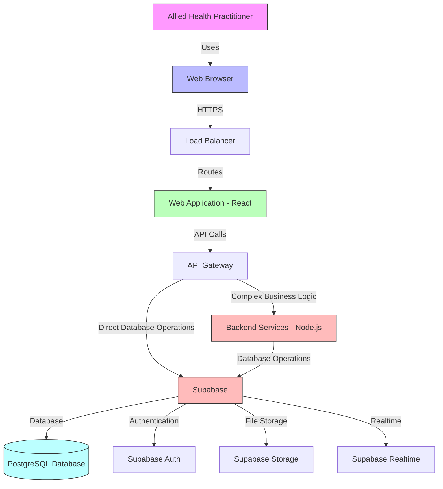
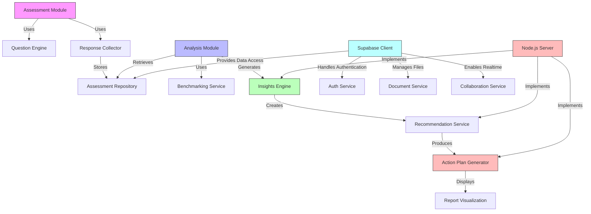
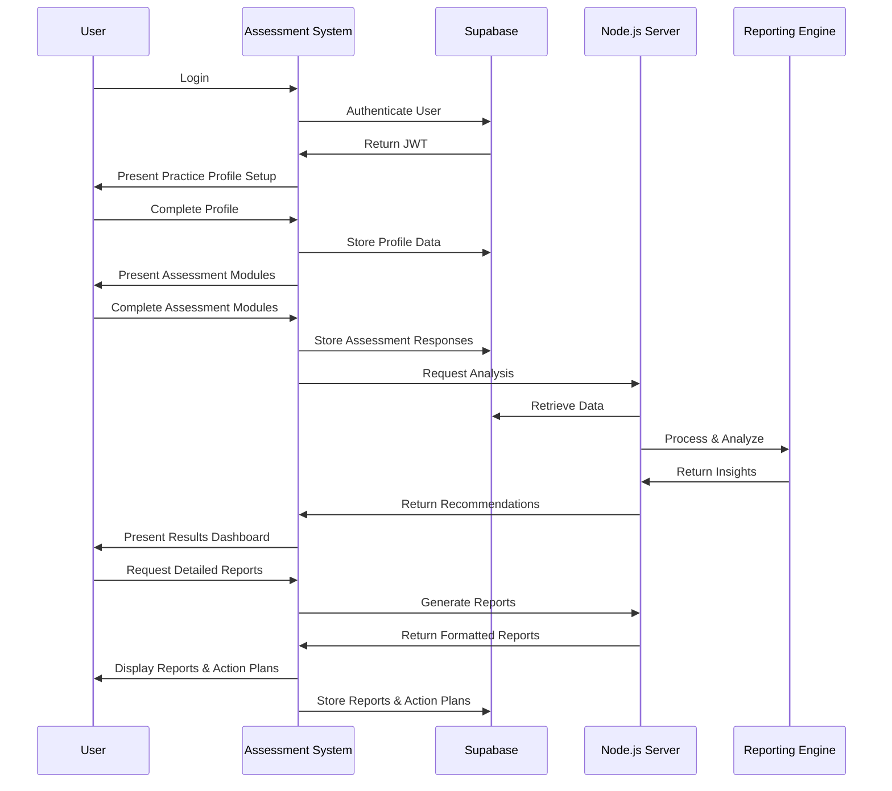

## Technical Summary
This architecture defines a modern, secure, and scalable web application for allied health practitioners to assess and improve their business operations. The system employs a client-server architecture with a React frontend, Node.js/Express backend for complex business logic, and Supabase as the primary database and backend service. This hybrid approach leverages Supabase's PostgreSQL database, authentication, storage, and realtime capabilities while maintaining custom server-side processing for specialized business logic. The architecture prioritizes user experience, data security, and extensibility to accommodate future enhancements such as AI-powered analytics and integrations with practice management systems.

## Technology Table

| Technology | Description |
|------------|-------------|
| TypeScript | Primary language for both frontend and backend development, providing type safety and improved maintainability |
| React | Frontend library for building the user interface with reusable components |
| Redux | State management for the React application |
| Node.js | Server-side JavaScript runtime for custom business logic and API endpoints |
| Express | Web application framework for Node.js |
| Supabase | Backend-as-a-Service (BaaS) providing PostgreSQL database, authentication, storage, and realtime features |
| PostgreSQL | Relational database provided by Supabase for storing user data, assessment responses, and benchmarking information |
| Jest | Testing framework for both frontend and backend |
| AWS | Secondary cloud infrastructure provider for additional services if needed |
| Chart.js | Data visualization library for assessment reports |
| TailwindCSS | Utility-first CSS framework for styling |
| Docker | Containerization for consistent development and deployment environments |
| GitHub Actions | CI/CD pipeline for automated testing and deployment |

## Architectural Diagrams

### System Architecture



### Component Architecture



### User Flow



## Data Models

### Practice Profile Schema
```json
{
  "id": "uuid",
  "name": "string",
  "ownerName": "string",
  "email": "string",
  "phone": "string",
  "practiceType": "enum(PHYSIOTHERAPY, OCCUPATIONAL_THERAPY, SPEECH_PATHOLOGY, DIETETICS, OTHER)",
  "numberOfPractitioners": "integer",
  "yearsInOperation": "integer",
  "location": {
    "address": "string",
    "city": "string",
    "state": "string",
    "postalCode": "string",
    "country": "string"
  },
  "annualRevenue": "decimal",
  "patientVolume": "integer",
  "userId": "uuid", // Reference to Supabase auth user
  "createdAt": "datetime",
  "updatedAt": "datetime"
}
```

### Assessment Module Schema
```json
{
  "id": "uuid",
  "name": "string",
  "description": "string",
  "category": "enum(FINANCIAL, OPERATIONS, MARKETING, STAFFING, COMPLIANCE)",
  "questions": [
    {
      "id": "uuid",
      "text": "string",
      "type": "enum(MULTIPLE_CHOICE, LIKERT_SCALE, NUMERIC, TEXT)",
      "options": ["array of strings, if applicable"],
      "weight": "float",
      "benchmarkReference": "string"
    }
  ],
  "createdAt": "datetime",
  "updatedAt": "datetime"
}
```

### Assessment Response Schema
```json
{
  "id": "uuid",
  "practiceId": "uuid",
  "moduleId": "uuid",
  "completedAt": "datetime",
  "responses": [
    {
      "questionId": "uuid",
      "response": "any",
      "notes": "string"
    }
  ],
  "score": "float",
  "userId": "uuid", // Reference to Supabase auth user
  "createdAt": "datetime",
  "updatedAt": "datetime"
}
```

### Recommendation Schema
```json
{
  "id": "uuid",
  "practiceId": "uuid",
  "assessmentId": "uuid",
  "category": "enum(FINANCIAL, OPERATIONS, MARKETING, STAFFING, COMPLIANCE)",
  "title": "string",
  "description": "string",
  "impact": "enum(HIGH, MEDIUM, LOW)",
  "effort": "enum(HIGH, MEDIUM, LOW)",
  "timeframe": "enum(IMMEDIATE, SHORT_TERM, LONG_TERM)",
  "steps": [
    {
      "order": "integer",
      "description": "string",
      "resources": ["array of resource references"]
    }
  ],
  "implementationStatus": "enum(NOT_STARTED, IN_PROGRESS, COMPLETED, DEFERRED)",
  "userId": "uuid", // Reference to Supabase auth user
  "createdAt": "datetime",
  "updatedAt": "datetime"
}
```

## Project Structure
```
/
├── /client                  # Frontend React application
│   ├── /public              # Static assets
│   ├── /src                 # Source code
│   │   ├── /components      # Reusable UI components
│   │   ├── /pages           # Page components
│   │   ├── /hooks           # Custom React hooks
│   │   ├── /services        # API service clients
│   │   │   ├── /supabase    # Supabase client and services
│   │   │   └── /api         # Custom API service clients
│   │   ├── /store           # Redux store configuration
│   │   ├── /types           # TypeScript type definitions
│   │   └── /utils           # Utility functions
│   ├── package.json         # Frontend dependencies
│   └── tsconfig.json        # TypeScript configuration
│
├── /server                  # Backend Node.js/Express application
│   ├── /src                 # Source code
│   │   ├── /api             # API routes and controllers
│   │   ├── /config          # Configuration files
│   │   ├── /middleware      # Express middleware
│   │   ├── /services        # Business logic services
│   │   │   ├── /assessment  # Assessment scoring and analysis
│   │   │   ├── /reporting   # Report generation
│   │   │   └── /sop         # SOP generation services
│   │   ├── /utils           # Utility functions
│   │   └── /validation      # Input validation schemas
│   ├── package.json         # Backend dependencies
│   └── tsconfig.json        # TypeScript configuration
│
├── /supabase                # Supabase configuration
│   ├── /functions           # Edge Functions for simple operations
│   ├── /migrations          # Database migrations
│   └── /seed                # Seed data scripts
│
├── /tests                   # Test files
│   ├── /unit                # Unit tests
│   ├── /integration         # Integration tests
│   └── /e2e                 # End-to-end tests
│
├── /docs                    # Documentation
│   ├── /api                 # API documentation
│   └── /user                # User guides
│
├── /scripts                 # Build and deployment scripts
│
├── docker-compose.yml       # Docker configuration
├── .github                  # GitHub Actions workflows
└── README.md                # Project overview
```

## Supabase Implementation Details

### Authentication
- Supabase Auth will handle user registration, login, and session management
- JWT tokens will be used for secure API access to both Supabase and custom Node.js endpoints
- Role-based access control will be implemented using Supabase's RLS policies
- Social login options will be available for practitioners (Google, Microsoft)
- Password reset and email verification flows will be handled by Supabase

### Database
- PostgreSQL database hosted by Supabase
- Row-Level Security (RLS) policies to ensure data privacy and security
- Database triggers for automated actions (e.g., updating timestamps)
- PostgreSQL functions for simple business logic
- Foreign key relationships to maintain data integrity
- Indexes for optimized query performance

### Storage
- Supabase Storage for file management
- Secure access control for uploaded files
- Organization of files by practice and assessment
- Support for various document formats (PDF, DOCX, etc.)
- Image optimization for profile pictures and practice logos

### Realtime
- Supabase Realtime for collaborative assessment editing
- Live updates for assessment progress
- Real-time notifications for completed assessments and recommendations
- Subscription-based updates for dashboard metrics

### Node.js Server Responsibilities
- Complex business logic that exceeds Supabase capabilities
- Advanced scoring algorithms and normalization
- Sophisticated report generation
- SOP generation using RAG models
- Integration with external APIs and services
- Batch processing and scheduled tasks
- Complex data transformations and analytics

### Security Measures
- Row-Level Security (RLS) policies for all Supabase tables
- JWT validation for all API requests
- Encrypted data transmission
- Regular security audits
- Compliance with healthcare data regulations
- API rate limiting to prevent abuse

## Change Log

| Change | Story ID | Description |
|--------|----------|-------------|
| Initial Architecture | N/A | Initial system design and documentation | 
| Supabase Integration | Story-1 | Added Supabase as primary database and backend service while maintaining Node.js server for complex business logic |