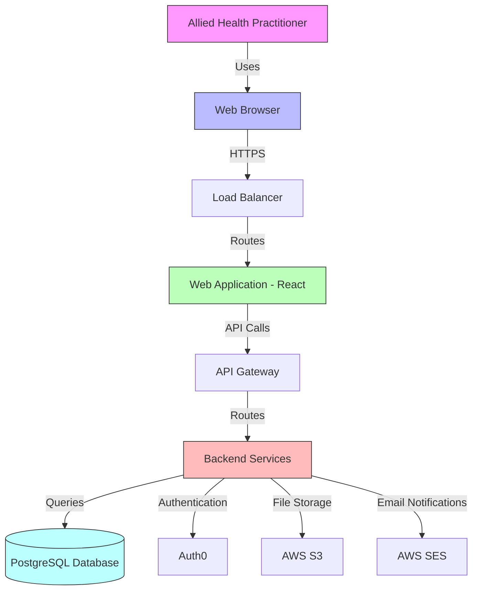
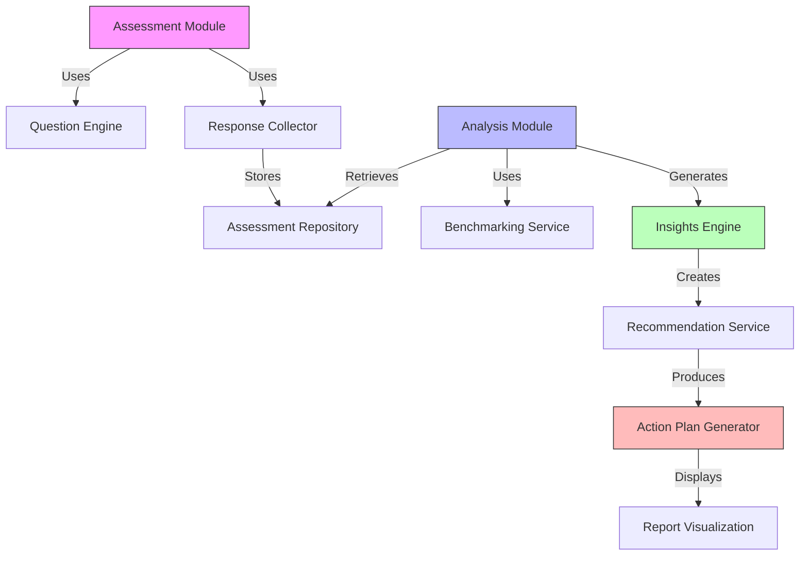
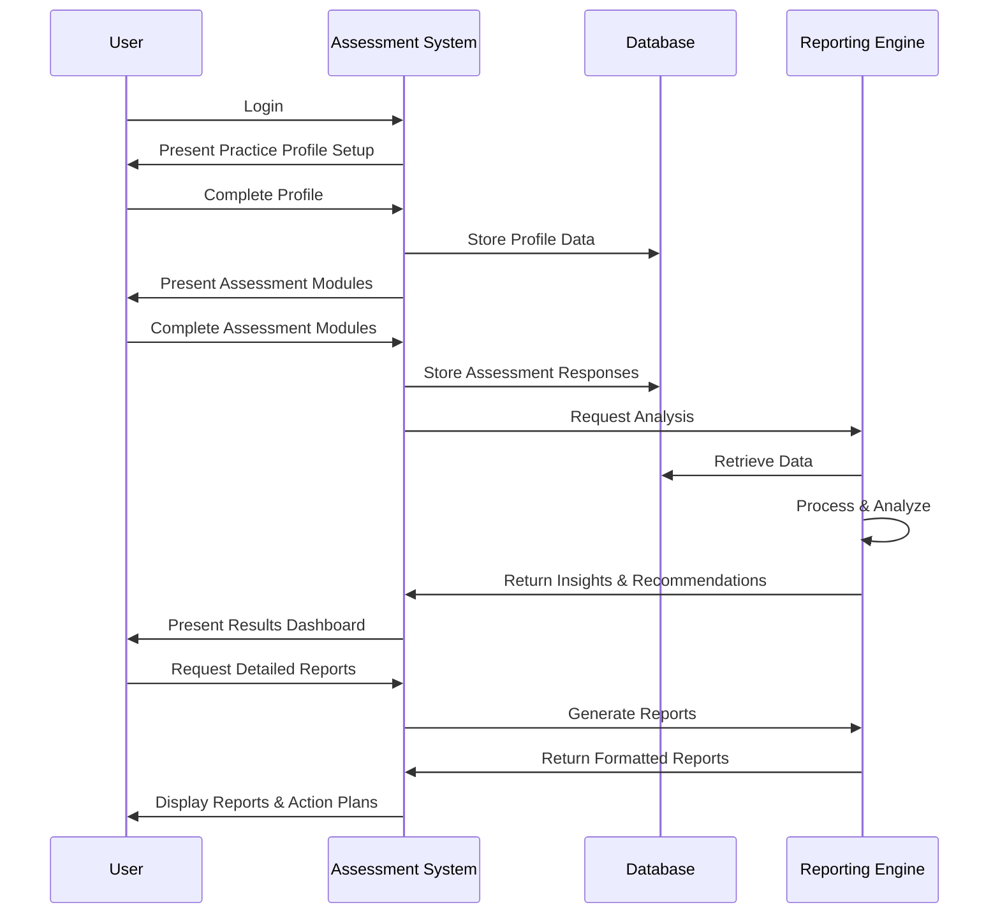

# Architecture for Allied Health Business Assessment Tool

## Status: Draft

## Technical Summary
This architecture defines a modern, secure, and scalable web application for allied health practitioners to assess and improve their business operations. The system employs a client-server architecture with a React frontend and Node.js/Express backend, utilizing a PostgreSQL database for data persistence. The architecture prioritizes user experience, data security, and extensibility to accommodate future enhancements such as AI-powered analytics and integrations with practice management systems.

## Technology Table

| Technology | Description |
|------------|-------------|
| TypeScript | Primary language for both frontend and backend development, providing type safety and improved maintainability |
| React | Frontend library for building the user interface with reusable components |
| Redux | State management for the React application |
| Node.js | Server-side JavaScript runtime |
| Express | Web application framework for Node.js |
| PostgreSQL | Relational database for storing user data, assessment responses, and benchmarking information |
| Prisma | ORM for database access and management |
| Jest | Testing framework for both frontend and backend |
| AWS | Cloud infrastructure provider for hosting and services |
| Auth0 | Authentication and authorization service |
| Chart.js | Data visualization library for assessment reports |
| TailwindCSS | Utility-first CSS framework for styling |
| Docker | Containerization for consistent development and deployment environments |
| GitHub Actions | CI/CD pipeline for automated testing and deployment |

## Architectural Diagrams

### System Architecture



### Component Architecture



### User Flow



## Data Models

### Practice Profile Schema
```json
{
  "id": "uuid",
  "name": "string",
  "ownerName": "string",
  "email": "string",
  "phone": "string",
  "practiceType": "enum(PHYSIOTHERAPY, OCCUPATIONAL_THERAPY, SPEECH_PATHOLOGY, DIETETICS, OTHER)",
  "numberOfPractitioners": "integer",
  "yearsInOperation": "integer",
  "location": {
    "address": "string",
    "city": "string",
    "state": "string",
    "postalCode": "string",
    "country": "string"
  },
  "annualRevenue": "decimal",
  "patientVolume": "integer",
  "createdAt": "datetime",
  "updatedAt": "datetime"
}
```

### Assessment Module Schema
```json
{
  "id": "uuid",
  "name": "string",
  "description": "string",
  "category": "enum(FINANCIAL, OPERATIONS, MARKETING, STAFFING, COMPLIANCE)",
  "questions": [
    {
      "id": "uuid",
      "text": "string",
      "type": "enum(MULTIPLE_CHOICE, LIKERT_SCALE, NUMERIC, TEXT)",
      "options": ["array of strings, if applicable"],
      "weight": "float",
      "benchmarkReference": "string"
    }
  ],
  "createdAt": "datetime",
  "updatedAt": "datetime"
}
```

### Assessment Response Schema
```json
{
  "id": "uuid",
  "practiceId": "uuid",
  "moduleId": "uuid",
  "completedAt": "datetime",
  "responses": [
    {
      "questionId": "uuid",
      "response": "any",
      "notes": "string"
    }
  ],
  "score": "float",
  "createdAt": "datetime",
  "updatedAt": "datetime"
}
```

### Recommendation Schema
```json
{
  "id": "uuid",
  "practiceId": "uuid",
  "assessmentId": "uuid",
  "category": "enum(FINANCIAL, OPERATIONS, MARKETING, STAFFING, COMPLIANCE)",
  "title": "string",
  "description": "string",
  "impact": "enum(HIGH, MEDIUM, LOW)",
  "effort": "enum(HIGH, MEDIUM, LOW)",
  "timeframe": "enum(IMMEDIATE, SHORT_TERM, LONG_TERM)",
  "steps": [
    {
      "order": "integer",
      "description": "string",
      "resources": ["array of resource references"]
    }
  ],
  "implementationStatus": "enum(NOT_STARTED, IN_PROGRESS, COMPLETED, DEFERRED)",
  "createdAt": "datetime",
  "updatedAt": "datetime"
}
```

## Project Structure
```
/
├── /client                  # Frontend React application
│   ├── /public              # Static assets
│   ├── /src                 # Source code
│   │   ├── /components      # Reusable UI components
│   │   ├── /pages           # Page components
│   │   ├── /hooks           # Custom React hooks
│   │   ├── /services        # API service clients
│   │   ├── /store           # Redux store configuration
│   │   ├── /types           # TypeScript type definitions
│   │   └── /utils           # Utility functions
│   ├── package.json         # Frontend dependencies
│   └── tsconfig.json        # TypeScript configuration
│
├── /server                  # Backend Node.js/Express application
│   ├── /src                 # Source code
│   │   ├── /api             # API routes and controllers
│   │   ├── /config          # Configuration files
│   │   ├── /middleware      # Express middleware
│   │   ├── /models          # Data models and schemas
│   │   ├── /services        # Business logic services
│   │   ├── /utils           # Utility functions
│   │   └── /validation      # Input validation schemas
│   ├── package.json         # Backend dependencies
│   └── tsconfig.json        # TypeScript configuration
│
├── /prisma                  # Database ORM
│   ├── /migrations          # Database migrations
│   └── schema.prisma        # Database schema
│
├── /tests                   # Test files
│   ├── /unit                # Unit tests
│   ├── /integration         # Integration tests
│   └── /e2e                 # End-to-end tests
│
├── /docs                    # Documentation
│   ├── /api                 # API documentation
│   └── /user                # User guides
│
├── /scripts                 # Build and deployment scripts
│
├── docker-compose.yml       # Docker configuration
├── .github                  # GitHub Actions workflows
└── README.md                # Project overview
```

## Change Log

| Change | Story ID | Description |
|--------|----------|-------------|
| Initial Architecture | N/A | Initial system design and documentation | 