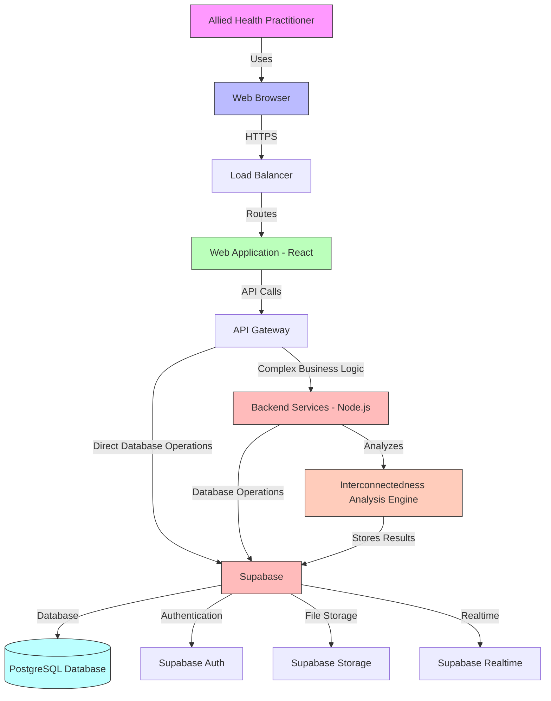
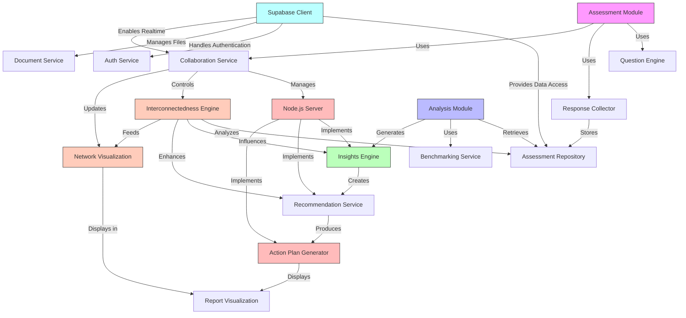
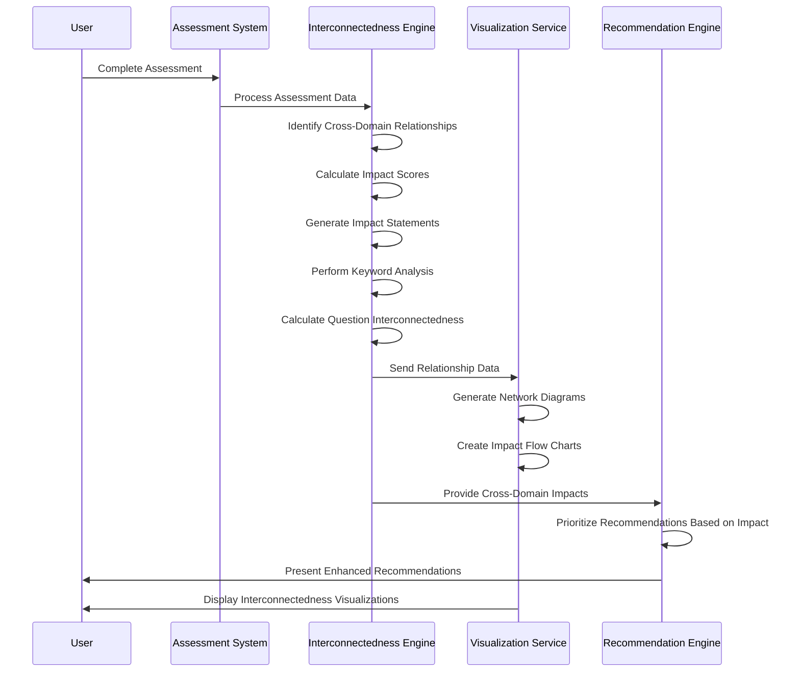
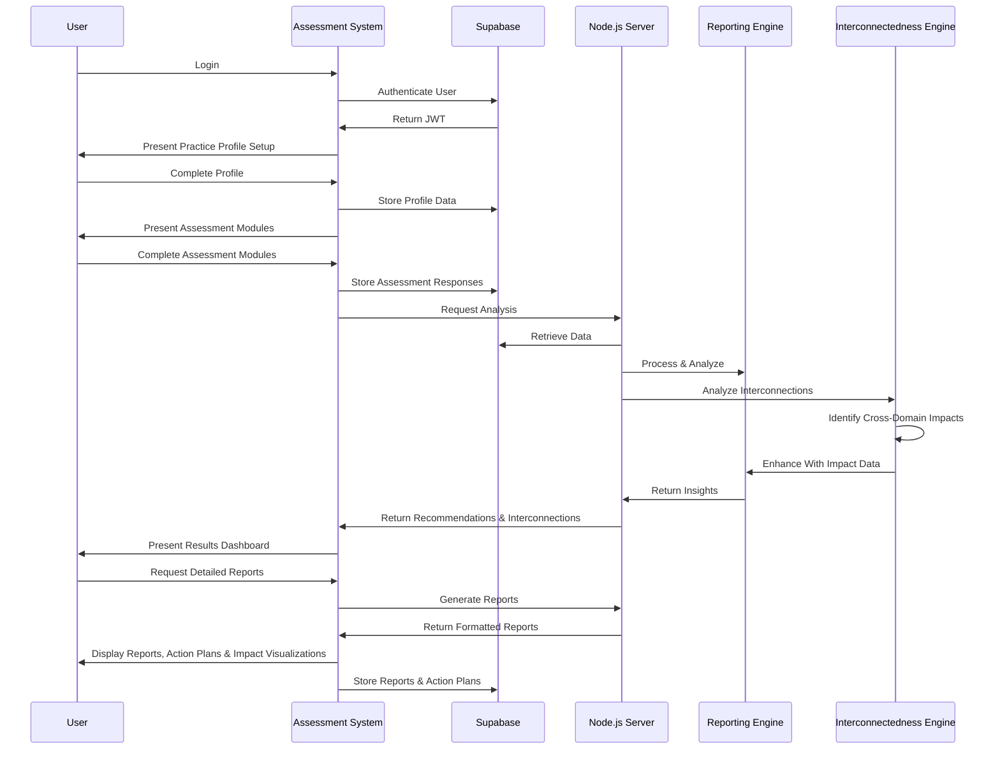
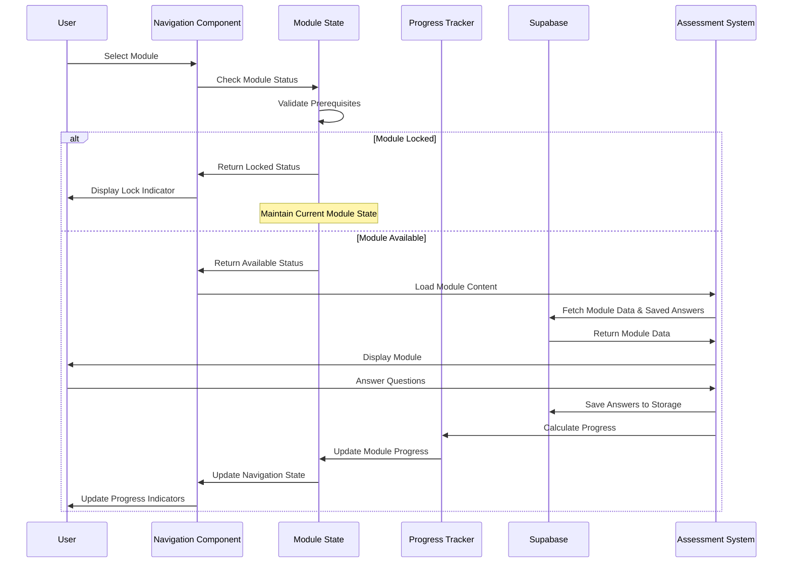

## Status: Approved

## Technical Summary
This architecture defines a modern, secure, and scalable web application for allied health practitioners to assess and improve their business operations. The system employs a client-server architecture with a React frontend, Node.js/Express backend for complex business logic, and Supabase as the primary database and backend service. This hybrid approach leverages Supabase's PostgreSQL database, authentication, storage, and realtime capabilities while maintaining custom server-side processing for specialized business logic. The architecture prioritizes user experience, data security, and extensibility to accommodate future enhancements such as AI-powered analytics and integrations with practice management systems.

A key architectural component is the Business Area Interconnectedness Analysis system, which identifies relationships between different business domains and provides actionable insights into how changes in one area impact others. This cross-domain analysis enables practitioners to make more informed decisions by understanding the broader implications of their business strategies.

## Technology Table

| Technology | Description |
|------------|-------------|
| TypeScript | Primary language for both frontend and backend development, providing type safety and improved maintainability |
| React | Frontend library for building the user interface with reusable components |
| Radix UI | Unstyled, accessible component library for building high-quality web applications |
| Redux | State management for the React application |
| Node.js | Server-side JavaScript runtime for custom business logic and API endpoints |
| Express | Web application framework for Node.js |
| Supabase | Backend-as-a-Service (BaaS) providing PostgreSQL database, authentication, storage, and realtime features |
| PostgreSQL | Relational database provided by Supabase for storing user data, assessment responses, and benchmarking information |
| Jest | Testing framework for both frontend and backend |
| AWS | Secondary cloud infrastructure provider for additional services if needed |
| Chart.js | Data visualization library for assessment reports |
| D3.js | Advanced data visualization library for interconnectedness diagrams and network graphs |
| TailwindCSS | Utility-first CSS framework for styling |
| Docker | Containerization for consistent development and deployment environments |
| GitHub Actions | CI/CD pipeline for automated testing and deployment |

## Architectural Diagrams

### System Architecture



### Component Architecture



### Interconnectedness Analysis Flow



### User Flow



### Module Navigation Flow



### State Management Requirements

1. **Module State Persistence**
   - Current module selection must persist when attempting to access locked modules
   - Module progress must be accurately calculated based on answered questions
   - Module prerequisites must be enforced for navigation

2. **Answer Management**
   - All answers must be immediately persisted to localStorage
   - Progress calculations must reflect the current state of answers
   - Answer changes must trigger progress updates

3. **Progress Tracking**
   - Progress should be calculated per module
   - Progress indicators should update in real-time
   - Progress should be displayed consistently across navigation and content areas

## Data Models

### Practice Profile Schema
```json
{
  "id": "uuid",
  "name": "string",
  "ownerName": "string",
  "email": "string",
  "phone": "string",
  "practiceType": "enum(PHYSIOTHERAPY, OCCUPATIONAL_THERAPY, SPEECH_PATHOLOGY, DIETETICS, OTHER)",
  "numberOfPractitioners": "integer",
  "yearsInOperation": "integer",
  "location": {
    "address": "string",
    "city": "string",
    "state": "string",
    "postalCode": "string",
    "country": "string"
  },
  "annualRevenue": "decimal",
  "patientVolume": "integer",
  "userId": "uuid", // Reference to Supabase auth user
  "createdAt": "datetime",
  "updatedAt": "datetime"
}
```

### Assessment Module Schema
```json
{
  "id": "uuid",
  "name": "string",
  "description": "string",
  "category": "enum(FINANCIAL, OPERATIONS, MARKETING, STAFFING, COMPLIANCE)",
  "questions": [
    {
      "id": "uuid",
      "text": "string",
      "type": "enum(MULTIPLE_CHOICE, LIKERT_SCALE, NUMERIC, TEXT)",
      "options": ["array of strings, if applicable"],
      "weight": "float",
      "benchmarkReference": "string",
      "interconnectednessScore": "float", // Score indicating cross-domain relevance
      "relatedBusinessAreas": ["array of business areas this question relates to"]
    }
  ],
  "createdAt": "datetime",
  "updatedAt": "datetime"
}
```

### Assessment Response Schema
```json
{
  "id": "uuid",
  "practiceId": "uuid",
  "moduleId": "uuid",
  "completedAt": "datetime",
  "responses": [
    {
      "questionId": "uuid",
      "response": "any",
      "notes": "string"
    }
  ],
  "score": "float",
  "userId": "uuid", // Reference to Supabase auth user
  "createdAt": "datetime",
  "updatedAt": "datetime"
}
```

### Recommendation Schema
```json
{
  "id": "uuid",
  "practiceId": "uuid",
  "assessmentId": "uuid",
  "category": "enum(FINANCIAL, OPERATIONS, MARKETING, STAFFING, COMPLIANCE)",
  "title": "string",
  "description": "string",
  "impact": "enum(HIGH, MEDIUM, LOW)",
  "effort": "enum(HIGH, MEDIUM, LOW)",
  "timeframe": "enum(IMMEDIATE, SHORT_TERM, LONG_TERM)",
  "steps": [
    {
      "order": "integer",
      "description": "string",
      "resources": ["array of resource references"]
    }
  ],
  "implementationStatus": "enum(NOT_STARTED, IN_PROGRESS, COMPLETED, DEFERRED)",
  "crossDomainImpacts": [
    {
      "impactedArea": "enum(FINANCIAL, OPERATIONS, MARKETING, STAFFING, COMPLIANCE)",
      "impactScore": "float", // 1-10 scale
      "impactStatement": "string"
    }
  ],
  "interconnectednessScore": "float", // Higher scores indicate broader impact
  "userId": "uuid", // Reference to Supabase auth user
  "createdAt": "datetime",
  "updatedAt": "datetime"
}
```

### Business Area Interconnectedness Schema
```json
{
  "id": "uuid",
  "practiceId": "uuid",
  "sourceCategory": "enum(FINANCIAL, OPERATIONS, MARKETING, STAFFING, COMPLIANCE)",
  "impactedCategory": "enum(FINANCIAL, OPERATIONS, MARKETING, STAFFING, COMPLIANCE)",
  "impactScore": "float", // 1-10 scale
  "impactStatement": "string",
  "relatedSourceQuestions": ["array of question IDs"],
  "relatedImpactedQuestions": ["array of question IDs"],
  "keywords": ["array of common keywords"],
  "createdAt": "datetime",
  "updatedAt": "datetime"
}
```

### Question Interconnectedness Schema
```json
{
  "id": "uuid",
  "questionId": "uuid",
  "score": "float", // Interconnectedness score (higher = more interconnected)
  "relatedAreas": ["array of business areas this question relates to"],
  "keyInsight": "string", // Key insight about this question's cross-domain relevance
  "createdAt": "datetime",
  "updatedAt": "datetime"
}
```

## Project Structure
```
/
├── /client                  # Frontend React application
│   ├── /public              # Static assets
│   ├── /src                 # Source code
│   │   ├── /components      # Reusable UI components
│   │   │   ├── /assessment  # Assessment-related components
│   │   │   ├── /insights    # Insight and reporting components
│   │   │   ├── /interconnect # Interconnectedness visualization components
│   │   │   ├── /pages           # Page components
│   │   │   ├── /hooks           # Custom React hooks
│   │   │   ├── /services        # API service clients
│   │   │   │   ├── /supabase    # Supabase client and services
│   │   │   │   ├── /api         # Custom API service clients
│   │   │   │   ├── /analysis    # Analysis service clients
│   │   │   │   ├── /store           # Redux store configuration
│   │   │   │   ├── /types           # TypeScript type definitions
│   │   │   │   └── /utils           # Utility functions
│   │   │   │       ├── /formatters  # Data formatting utilities
│   │   │   │       ├── /analysis    # Analysis helper functions
│   │   │   │       ├── /visualization # Visualization utilities
│   │   │   │   ├── package.json         # Frontend dependencies
│   │   │   │   └── tsconfig.json        # TypeScript configuration
│   │   │   │
│   │   ├── /server                  # Backend Node.js/Express application
│   │   │   ├── /src                 # Source code
│   │   │   │   ├── /api             # API routes and controllers
│   │   │   │   ├── /config          # Configuration files
│   │   │   │   ├── /middleware      # Express middleware
│   │   │   │   ├── /services        # Business logic services
│   │   │   │   │   ├── /assessment  # Assessment scoring and analysis
│   │   │   │   │   ├── /reporting   # Report generation
│   │   │   │   │   ├── /sop         # SOP generation services
│   │   │   │   │   ├── /interconnect # Interconnectedness analysis services
│   │   │   │   │   ├── /utils           # Utility functions
│   │   │   │   │   └── /validation      # Input validation schemas
│   │   │   │   ├── package.json         # Backend dependencies
│   │   │   │   └── tsconfig.json        # TypeScript configuration
│   │   │   │
│   │   ├── /supabase                # Supabase configuration
│   │   │   │   ├── /functions           # Edge Functions for simple operations
│   │   │   │   ├── /migrations          # Database migrations
│   │   │   │   └── /seed                # Seed data scripts
│   │   │   │
│   │   ├── /tests                   # Test files
│   │   │   │   ├── /unit                # Unit tests
│   │   │   │   │   ├── /services        # Service tests
│   │   │   │   │   ├── /interconnect    # Interconnectedness analysis tests
│   │   │   │   │   └── /integration         # Integration tests
│   │   │   │   └── /e2e                 # End-to-end tests
│   │   │   │
│   │   ├── /docs                    # Documentation
│   │   │   │   ├── /api                 # API documentation
│   │   │   │   └── /user                # User guides
│   │   │   │
│   │   ├── /scripts                 # Build and deployment scripts
│   │   │
│   │   └── docker-compose.yml       # Docker configuration
│   │
│   └── .github                  # GitHub Actions workflows
│       └── README.md                # Project overview
```

## Interconnectedness Analysis Engine

The Interconnectedness Analysis Engine is a critical component that analyzes relationships between different business areas and quantifies how changes in one domain impact others. This system helps practitioners make more informed decisions by understanding the broader implications of their business strategies.

### Key Components

#### Impact Analyzer
- Analyzes assessment responses to identify cross-domain relationships
- Calculates impact scores (1-10) between different business areas
- Generates impact statements describing how areas influence each other
- Customizes analysis based on practice profile and assessment results

#### Keyword Analysis
- Identifies common terminology across business modules
- Performs frequency analysis to highlight prevalent cross-domain concepts
- Maps terms to show where key concepts appear across the assessment
- Helps identify common themes that bridge multiple business areas

#### Question Interconnectedness Scorer
- Scores questions based on their relevance to multiple business domains
- Identifies questions with high cross-domain impact
- Highlights questions that bridge three or more business areas
- Provides insights into central business processes affecting multiple areas

#### Network Visualization
- Generates interactive network diagrams showing relationships between business areas
- Creates impact flow charts illustrating how changes propagate
- Provides heat maps highlighting the most interconnected areas
- Uses D3.js for advanced, interactive data visualizations

#### Prioritization Engine
- Enhances recommendation prioritization with cross-domain impact data
- Favors improvements with positive cascading effects
- Adjusts impact weighting based on practice type and size
- Helps practitioners focus on changes with the broadest positive impact

### Implementation Approach

The Interconnectedness Analysis Engine is implemented using a hybrid approach:
1. Core algorithms run in the Node.js backend for complex analysis
2. Results are stored in Supabase for efficient retrieval
3. Visualization components render in the React frontend
4. Real-time updates via Supabase Realtime when assessment data changes

The engine uses a modular design pattern allowing for future enhancements:
- Pluggable analysis algorithms for different practice types
- Extensible visualization components for various data views
- Framework for adding new business area relationships
- Support for discipline-specific relationship models

### Data Flow

1. Assessment data is collected through the questionnaire
2. Node.js backend processes responses to identify patterns
3. Interconnectedness Engine analyzes cross-domain relationships
4. Impact scores and statements are generated and stored
5. Recommendation Engine incorporates relationship data
6. Visualization components render network diagrams and impact charts
7. User interface presents insights in context with assessment results

## Supabase Implementation Details

### Authentication
- Supabase Auth will handle user registration, login, and session management
- JWT tokens will be used for secure API access to both Supabase and custom Node.js endpoints
- Role-based access control will be implemented using Supabase's RLS policies
- Social login options will be available for practitioners (Google, Microsoft)
- Password reset and email verification flows will be handled by Supabase

### Database
- PostgreSQL database hosted by Supabase
- Row-Level Security (RLS) policies to ensure data privacy and security
- Database triggers for automated actions (e.g., updating timestamps)
- PostgreSQL functions for simple business logic
- Foreign key relationships to maintain data integrity
- Indexes for optimized query performance
- Custom tables for storing interconnectedness analysis results

### Storage
- Supabase Storage for file management
- Secure access control for uploaded files
- Organization of files by practice and assessment
- Support for various document formats (PDF, DOCX, etc.)
- Image optimization for profile pictures and practice logos

### Realtime
- Supabase Realtime for collaborative assessment editing
- Live updates for assessment progress
- Real-time notifications for completed assessments and recommendations
- Subscription-based updates for dashboard metrics
- Live updates to interconnectedness visualizations when data changes

### Node.js Server Responsibilities
- Complex business logic that exceeds Supabase capabilities
- Advanced scoring algorithms and normalization
- Sophisticated report generation
- SOP generation using RAG models
- Integration with external APIs and services
- Batch processing and scheduled tasks
- Complex data transformations and analytics
- Cross-domain impact analysis and interconnectedness scoring
- Advanced network visualization data preparation

### Security Measures
- Row-Level Security (RLS) policies for all Supabase tables
- JWT validation for all API requests
- Encrypted data transmission
- Regular security audits
- Compliance with healthcare data regulations
- API rate limiting to prevent abuse

## Change Log

| Change | Story ID | Description |
|--------|----------|-------------|
| Initial Architecture | N/A | Initial system design and documentation | 
| Supabase Integration | Story-1 | Added Supabase as primary database and backend service while maintaining Node.js server for complex business logic |
| Interconnectedness Analysis | Story-14 | Added Business Area Interconnectedness Analysis Engine and related components |
| Testing Framework Enhancement | Story-2a | Updated testing framework with comprehensive mock implementations, improved coverage metrics tracking, and standardized test organization |

## Testing Framework

### Test Setup and Configuration
- Jest as the primary testing framework
- React Testing Library for component testing
- Configured with custom test environment in `tests/setupTests.ts`
- React 18 concurrent features enabled for testing
- Supabase mock implementations for database testing
- Automated cleanup after each test
- Console logging for test environment debugging
- Local storage mocking for offline functionality testing

### Test Coverage
- Total Test Suites: 17
- Total Tests: 206
- Coverage Areas:
  - Service Layer Tests
  - Component Tests
  - Controller Tests
  - Integration Tests
  - Offline Functionality Tests
- Coverage Metrics:
  - Branch Coverage: 75.96%
  - Target Coverage: 80%
  - Current Gap: 4.04%

### Test Environment Features
- Custom test ID attribute for component queries
- Automated mock cleanup after each test
- Standardized Supabase mock chain implementation
- Comprehensive error handling validation
- Offline/online state simulation

### Mock Implementation Standards
```typescript
// Standard Supabase mock chain implementation
const mockChain = {
  select: jest.fn().mockReturnValue({
    eq: jest.fn().mockReturnValue({
      is: jest.fn().mockReturnValue({
        single: jest.fn().mockResolvedValue({ data: mockData, error: null })
      })
    })
  })
};

// Comprehensive Supabase Client mock
const mockSupabaseClient = {
  from: (table: string) => ({
    select: () => ({
      single: () => Promise.resolve(mockData),
      maybeSingle: () => Promise.resolve(mockData)
    }),
    insert: () => ({
      single: () => Promise.resolve(mockData)
    }),
    upsert: () => ({
      single: () => Promise.resolve(mockData)
    }),
    update: () => ({
      single: () => Promise.resolve(mockData)
    })
  })
};
```

### Test Organization
- Unit Tests: `/tests/unit/*`
  - Services: Database and business logic
  - Components: UI elements and interactions
  - Controllers: Flow and state management
- Integration Tests: `/tests/integration/*`
  - API endpoints
  - Component interactions
  - Service interactions
- End-to-End Tests: `/tests/e2e/*`
  - User flows
  - Critical paths
  - Performance scenarios

### Error Handling Tests
- Validation errors
- Database errors
- Network errors
- Offline state handling
- Edge cases and boundary conditions

### Performance Testing
- Load testing configurations
- Stress test scenarios
- Concurrent operations handling
- Response time benchmarks