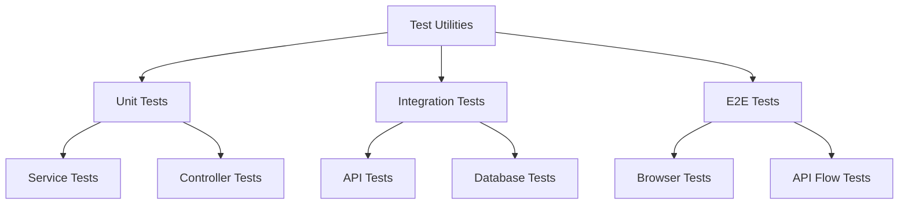

# Test Dependency Analysis

## Current State

### Core Test Dependencies
1. **Test Utilities**
   - `MockDataFactory`: ✅ Complete
     - Handles both client and server question types
     - Supports bulk creation methods
     - Provides comprehensive mock data generation
   - `TestContextBuilder`: ✅ Complete
     - Supports module generation
     - Handles service context building
     - Manages test isolation

2. **Test Categories**
   - Unit Tests
     - QuestionService: ✅ Complete
     - ModuleService: 🔄 In Progress
     - AssessmentService: ❌ Not Started
   - Integration Tests: ❌ Not Started
   - E2E Tests: ❌ Not Started

### Dependency Graph

## Key Dependencies

### 1. Test Utilities
- **MockDataFactory**
  - Dependencies: Question, Module, Assessment models
  - Status: Complete
  - Used by: All test categories
  - Priority: High ✅

- **TestContextBuilder**
  - Dependencies: Services, Controllers, Database
  - Status: Complete
  - Used by: Integration and E2E tests
  - Priority: High ✅

### 2. Test Categories

#### Unit Tests
- **QuestionService Tests**
  - Dependencies: MockDataFactory
  - Status: Complete
  - Coverage: High
  - Priority: High ✅

- **ModuleService Tests**
  - Dependencies: MockDataFactory, TestContextBuilder
  - Status: In Progress
  - Coverage: Medium
  - Priority: High 🔄

- **AssessmentService Tests**
  - Dependencies: MockDataFactory, TestContextBuilder
  - Status: Not Started
  - Coverage: None
  - Priority: High ❌

#### Integration Tests
- **Service Integration**
  - Dependencies: All unit test components
  - Status: Not Started
  - Coverage: None
  - Priority: Medium ❌

- **API Integration**
  - Dependencies: Service integration, Controllers
  - Status: Not Started
  - Coverage: None
  - Priority: Medium ❌

#### E2E Tests
- **Browser Tests**
  - Dependencies: All integration components
  - Status: Not Started
  - Coverage: None
  - Priority: Low ❌

## Recommendations

1. **Immediate Focus**
   - Complete ModuleService unit tests
   - Start AssessmentService unit tests
   - Begin service integration test implementation

2. **Short-term Goals**
   - Implement API integration tests
   - Set up database integration tests
   - Create E2E test framework

3. **Long-term Goals**
   - Implement comprehensive E2E tests
   - Add performance testing
   - Set up continuous testing pipeline

## Risk Analysis

### High Risk Areas
1. Service integration points
2. Database interactions
3. API endpoints
4. Browser automation

### Mitigation Strategies
1. Comprehensive unit test coverage
2. Isolated test environments
3. Robust mock data generation
4. Clear test boundaries

## Next Steps

1. Complete remaining unit tests
2. Set up integration test infrastructure
3. Implement E2E test framework
4. Update documentation continuously

## Progress Tracking

### Completed
- ✅ MockDataFactory implementation
- ✅ TestContextBuilder implementation
- ✅ QuestionService tests
- ✅ Basic test utilities

### In Progress
- 🔄 ModuleService tests
- 🔄 Test organization
- 🔄 Documentation updates

### Not Started
- ❌ AssessmentService tests
- ❌ Integration tests
- ❌ E2E tests
- ❌ Performance testing

### Legend
✅ Complete
🔄 In Progress
❌ Not Started 