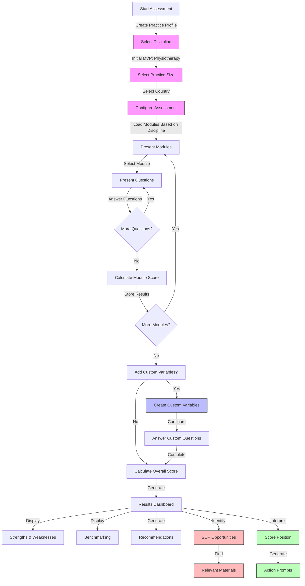
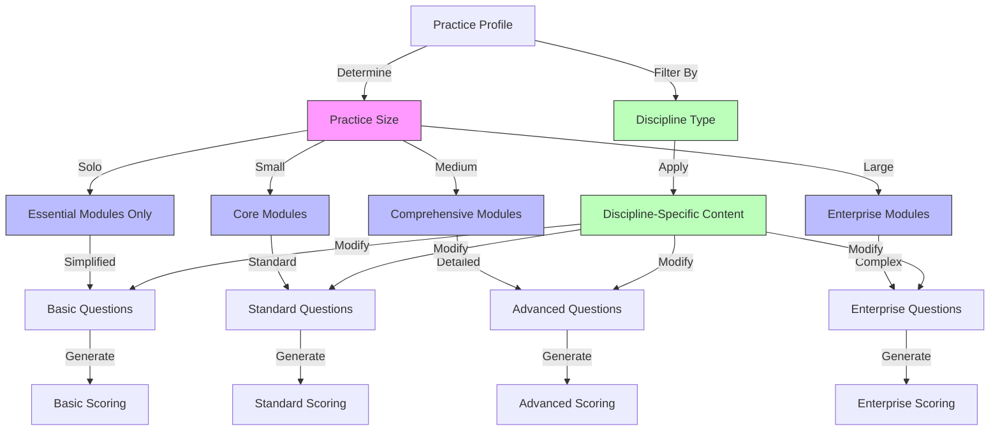
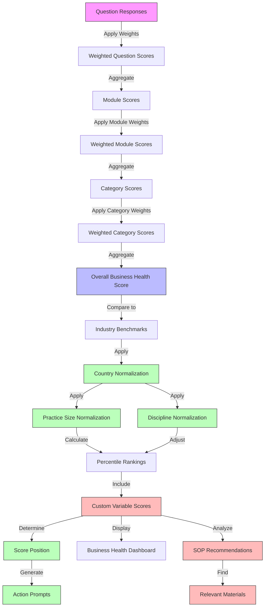
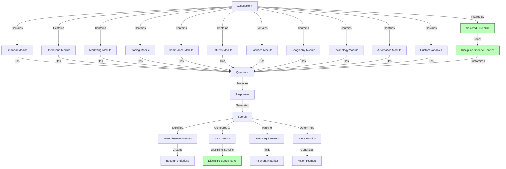
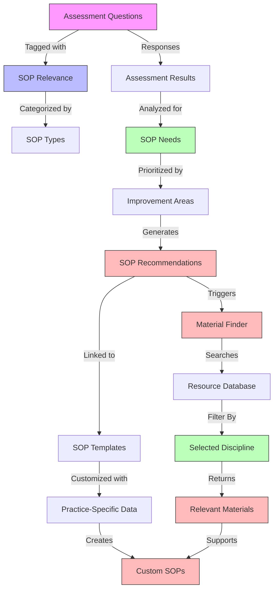
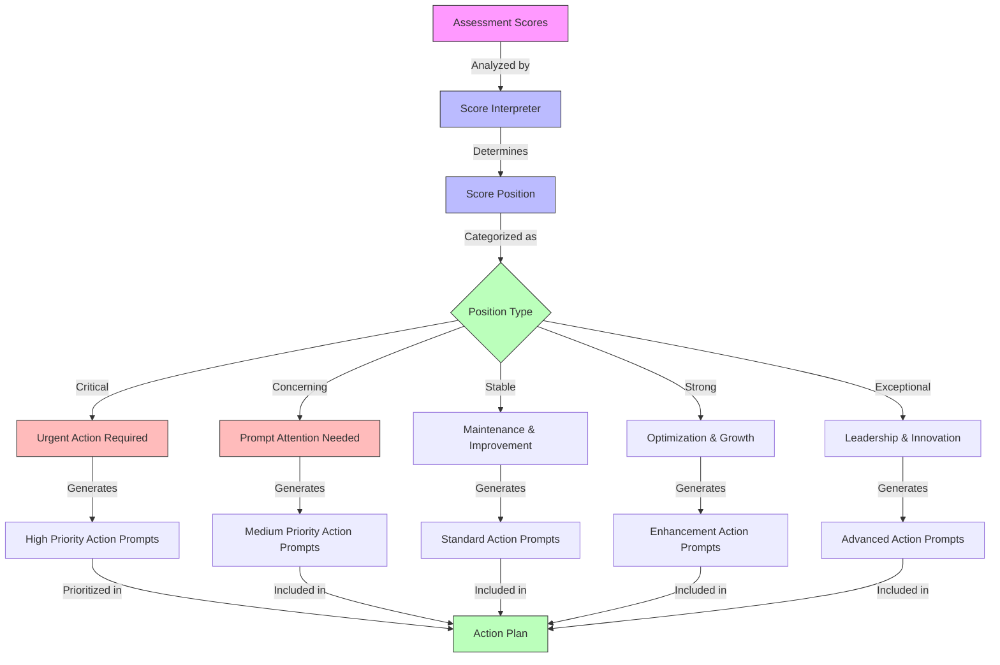
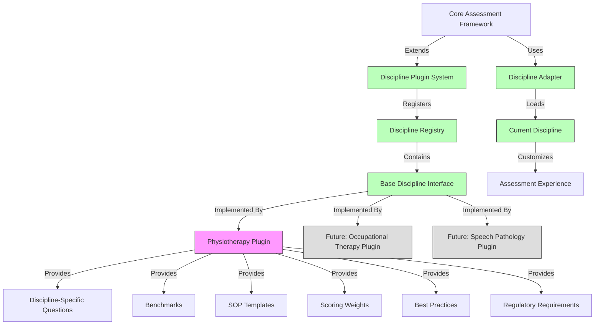

# Epic-1: Core Assessment Framework Development for Allied Health Practices
# Story-1: Design Comprehensive Business Assessment Questionnaire Structure with Weighted Scoring System for Allied Health Practices (Initial Focus: Physiotherapy)

## Story

**As an** allied health practitioner (initially focusing on physiotherapists)
**I want** a comprehensive business assessment questionnaire with quantifiable metrics that scales to my practice size
**so that** I can identify key areas for improvement in my practice with concrete, data-driven insights relevant to my specific context

## Status

In Progress

## Context

This is the first story in Epic-1 which focuses on developing the core assessment framework for the Allied Health Business Assessment Tool. The MVP will specifically target physiotherapy practices as the initial discipline before expanding to other allied health fields in future phases. The questionnaire structure is the foundation of the entire assessment process and will inform all subsequent development. The questionnaire needs to cover all major aspects of an allied health practice including financial health, operations, marketing, staffing, compliance, patient/client management, facilities, geographic considerations, technology integration, and automation opportunities.

A key requirement is that the assessment must provide quantifiable metrics through a weighted scoring system while maintaining simplicity and ease of use. The scoring system will enable practitioners to benchmark their performance against industry standards specific to their country (with Australia as the default) and track improvements over time with flexible tracking periods appropriate to each metric. The assessment must also scale appropriately based on practice size and complexity, from solo practitioners to multi-location practices.

Additionally, the assessment framework needs to be designed with future SOP generation capabilities in mind, ensuring that question responses can be mapped to relevant SOP templates for areas like practitioner onboarding, health screening protocols, compliance procedures, and other key practice processes. The system should support RAG (Retrieval-Augmented Generation) models for SOP creation and include metadata to support the SOP material finder feature that will help users locate relevant resources for creating comprehensive SOPs.

The framework must also include a score interpretation system that provides practitioners with a clear overview of their practice's position and specific action prompts based on their assessment results.

While the initial implementation will focus exclusively on physiotherapy practices, the architecture must be designed to easily accommodate other allied health disciplines in future phases without significant refactoring.

## Estimation

Story Points: 6

## Tasks

1. - [ ] Research and Analysis
   1. - [ ] Research common business challenges specific to physiotherapy practices of various sizes
   2. - [ ] Analyze existing business assessment frameworks and scoring methodologies in healthcare
   3. - [ ] Identify key performance indicators for allied health businesses with initial focus on physiotherapy
   4. - [ ] Research discipline-specific industry benchmarks and standards with initial focus on Australian physiotherapy market
   5. - [ ] Investigate country-specific compliance requirements and standards for allied health (starting with physiotherapy)
   6. - [ ] Research scaling methodologies for assessments based on practice size
   7. - [ ] Identify standard SOP requirements for allied health practices (initially physiotherapy)
   8. - [ ] Research score interpretation methodologies and action prompt systems
   9. - [ ] Investigate RAG model requirements for future SOP generation
   10. - [ ] Research sources of discipline-specific SOP materials and resources
   11. - [ ] Research discipline extension architecture patterns
   12. - [ ] Document findings and insights

2. - [x] Design Assessment Categories and Modules
   1. - [x] Define comprehensive set of assessment categories with relative importance weights (initial implementation for physiotherapy)
   2. - [x] Create module structure for each category with priority rankings
   3. - [x] Design scaling approach for modules based on practice size
   4. - [x] Determine scoring methodology and normalization approach with country-specific considerations
   5. - [x] Design category aggregation formula for overall business health score
   6. - [x] Create framework for custom variable integration
   7. - [x] Identify SOP-relevant assessment areas and tag accordingly for RAG model use
   8. - [x] Design score interpretation framework with positioning scale and action prompts
   9. - [x] Create metadata structure for SOP material finder integration
   10. - [x] Design extensible architecture for discipline-specific plugins
   11. - [x] Write tests for module structure and scoring validation

3. - [x] Develop Question Framework
   1. - [x] Design question types (multiple choice, Likert scale, numeric, text)
   2. - [x] Create question weighting system based on business impact (initial weights for physiotherapy)
   3. - [x] Develop question dependency logic and skip patterns
   4. - [x] Design answer option scoring scales (1-5, 1-10, percentage-based)
   5. - [x] Create formulas for calculating section and module scores
   6. - [x] Develop scaling logic to adjust question complexity based on practice size
   7. - [x] Design framework for country-specific question variants
   8. - [x] Create system for custom variable questions
   9. - [x] Add SOP relevance metadata to question schema with RAG model compatibility
   10. - [x] Design material finder tags for connecting questions to relevant resources
   11. - [x] Create action prompt mapping for score interpretation
   12. - [x] Design extension points for discipline-specific questions
   13. - [x] Write tests for question framework and scoring logic

4. - [x] Create Sample Questions
   1. - [x] Draft 10-15 sample questions per module with assigned weights for physiotherapy as the initial discipline
   2. - [x] Include questions covering all major business aspects (financial, operations, marketing, staffing, compliance, patients/clients, facilities, geography, technology, automation)
   3. - [x] Create size-specific question variants for different practice scales
   4. - [x] Define answer options for each question with corresponding scores
   5. - [x] Map questions to potential recommendations and improvement metrics
   6. - [x] Create sample scoring scenarios to validate the system
   7. - [x] Develop country-specific question variants (Australia as default)
   8. - [x] Create examples of custom variable questions
   9. - [x] Tag questions relevant to SOP generation with RAG model parameters
   10. - [x] Add material finder metadata to relevant questions
   11. - [x] Create sample score interpretations and action prompts for different scoring scenarios
   12. - [x] Identify which questions are universal vs. discipline-specific
   13. - [ ] Write tests for question validation and score calculation
   14. - [-] Develop comprehensive tooltips for all questions with plain language explanations
   15. - [-] Create enhanced tooltips for complex financial and compliance questions with examples and metric explanations
   16. - [ ] Review all tooltips for clarity, jargon elimination, and quantifiable context
   17. - [ ] Test tooltips with non-technical users to ensure comprehensibility

5. - [ ] Design Initial UI Wireframes
   1. - [ ] Create wireframes for questionnaire navigation with simplicity focus
   2. - [ ] Design question presentation layouts with progressive disclosure
   3. - [ ] Develop progress tracking interface with completion estimates
   4. - [ ] Design score visualization components (dashboards, charts, etc.)
   5. - [ ] Create wireframes for results presentation
   6. - [ ] Design UI for custom variable creation
   7. - [ ] Create wireframes for practice size selection and scaling
   8. - [ ] Design country selection interface
   9. - [ ] Create wireframes for SOP generation options
   10. - [ ] Design score interpretation and action prompt display
   11. - [ ] Create wireframes for SOP material finder interface
   12. - [ ] Design discipline selection and configuration interface
   13. - [ ] Write tests for UI components
   14. - [ ] Design tooltip presentation with focus on readability and accessibility
   15. - [ ] Create wireframes for interactive tooltip components with expandable examples
   16. - [ ] Design mobile-friendly tooltip layout for small screens
   17. - [ ] Create visual indicators for questions with enhanced tooltips for complex topics

## Progress Notes

### 2024-07-31: Implemented Core Module Framework

- Created ModuleService with comprehensive methods for managing and filtering assessment modules
- Implemented validation logic to ensure module integrity (id, name, category, applicable disciplines, etc.)
- Developed specialized methods for handling discipline-specific and country-specific module content
- Created sample physiotherapy assessment modules covering key areas:
  - Financial Health
  - Operational Efficiency
  - Patient Management
  - Technology Integration
  - Staffing and Professional Development
- Each module includes:
  - Practice size scaling (Solo to Enterprise)
  - Weighted scoring
  - Benchmarks with performance indicators
  - SOP relevance tagging
  - Score interpretation with position-based recommendations
  - Support for country-specific and discipline-specific variations
- Implemented test suite for all ModuleService functionality
- Successfully completed key aspects of the assessment module design (Task 2)
- Working on question framework implementation (Task 3)

### 2024-08-01: Implemented Question Framework and Sample Questions

- Created comprehensive question framework with support for:
  - Multiple choice, numeric, and other question types
  - Question weighting based on business impact
  - Country-specific and discipline-specific variants
  - Practice size scaling
  - SOP relevance with RAG model parameters
  - Material finder integration
  - Score interpretation with position-based action prompts
- Developed QuestionService with functionalities for:
  - Creating and validating questions
  - Filtering questions by module, category, discipline, practice size
  - Handling discipline-specific and country-specific question variants
- Created sample physiotherapy assessment questions for each module:
  - Financial health questions covering financial tracking, practitioner utilization, and pricing
  - Operations questions focusing on appointment management, patient wait times, and equipment maintenance
  - Patient management questions addressing outcome measurement, feedback collection, and treatment completion
  - Technology questions evaluating practice management software, telehealth usage, and digital tools
  - Staffing questions covering onboarding, continuing education, and performance evaluation
- Questions include detailed metadata for:
  - Weight and impact areas
  - Tracking periods
  - Benchmark references
  - SOP relevance with content mapping
  - Material finder integration
  - Position-based action prompts
- Successfully completed development of question framework (Task 3)
- Started work on advancing task 4 (Create Sample Questions)

### 2024-08-03: Expanded Question Modules with Additional Categories

- Implemented Geography module with comprehensive questions covering:
  - Location strategy questions addressing catchment area analysis, accessibility, proximity to referral sources, and competitor density
  - Demographic analysis questions examining demographic trends, service alignment with demographics, aging populations, income distribution, and cultural diversity
- Created Automation module with detailed questions covering:
  - Process automation questions focused on administrative automation, scheduling, patient engagement, revenue cycle management, and business intelligence
  - AI integration questions assessing clinical decision support, patient triage, predictive analytics, virtual assistants, and treatment personalization
- Expanded Patient Care module with additional question sets:
  - Patient experience questions addressing satisfaction metrics, feedback collection, service recovery, patient journey mapping, and treatment completion
  - Clinical pathway questions focusing on standardized care, evidence updates, variance tracking, provider compliance, and decision support tools
- Successfully completed implementation of all ten assessment categories defined in AssessmentCategory enum:
  - Financial, Operations, Marketing, Staffing, Compliance, Patients, Facilities, Geography, Technology, and Automation
- All new questions include:
  - Detailed help text with quantifiable metrics
  - Impact areas with business relevance
  - Practice size considerations
  - Score interpretation with actionable recommendations
  - SOP relevance metadata for future generation
- Implemented modular file structure for all question categories to support maintainability and extensibility
- Completed Task 4 (Create Sample Questions) with comprehensive coverage of all assessment areas
- Remaining tasks include:
  - Write tests for question validation and score calculation (Task 4.13)
  - Design UI wireframes (Task 5)

### 2024-08-04: Enhanced Question Tooltips and Accessibility

- Updated requirements to emphasize the importance of comprehensive, jargon-free tooltips for all questions
- Identified need for enhanced tooltip development with particular focus on:
  - Financial questions: Adding clear explanations of financial metrics, ratios, and accounting concepts
  - Compliance questions: Providing plain-language explanations of regulatory requirements and standards
  - Technical questions: Simplifying technology concepts for practitioners without technical backgrounds
- Added new tasks (4.14-4.17) focused specifically on tooltip development and testing
- Revised Question Schema to emphasize helpText as an essential tooltip feature with specific guidelines:
  - Must use plain language accessible to non-technical users
  - Should avoid jargon or clearly explain technical terms when necessary
  - Must include relevant metrics and contextual information
  - Should explain why the question matters to the practice's success
  - For complex topics, must provide comprehensive explanations with examples
- Established tooltip review process to ensure all explanations meet accessibility standards
- Determined need for user testing of tooltips with practitioners from various backgrounds
- Prioritized complex financial and compliance questions for enhanced tooltip development
- Identified financial topics requiring special attention:
  - Overhead ratio calculations and significance
  - Cash flow management concepts
  - Revenue cycle metrics
  - Profit margin analysis
  - Expense categorization
- All tooltips will include quantifiable context (industry benchmarks, metrics, etc.) to help users understand the significance of their answers

### 2024-08-05: Tooltip Readability Review Initiative

- **ACTION REQUIRED**: Conduct comprehensive review of all question helpText for readability and clarity
- Review will focus on ensuring all tooltips meet the plain language guidelines established in the requirements
- Special attention needed for:
  - Eliminating unnecessary technical jargon or clearly explaining it when unavoidable
  - Breaking down complex concepts into simple, digestible explanations
  - Using concrete examples that practitioners can relate to
  - Ensuring consistent tone and language difficulty across all tooltips
  - Verifying that tooltip length is appropriate (comprehensive but not overwhelming)
- Several examples of enhanced tooltips have been implemented (financial and compliance questions) that can serve as models
- All team members should review tooltips in their respective areas of expertise
- Readability testing with non-technical users will be scheduled following the review

## Constraints

- Questions must be answerable within 60 minutes total regardless of practice size
- Language must be clear and accessible to non-technical users
- Question structure must support benchmarking against industry standards
- Design must accommodate future AI-powered analysis
- UI must balance comprehensive assessment with simplicity of use
- Scoring system must be transparent and explainable to users
- Assessment must scale appropriately for different practice sizes
- System must support country-specific variations in compliance and benchmarks
- Custom variable framework must be flexible yet structured
- Question framework must support future SOP generation capabilities using RAG models
- Score interpretation must provide clear, actionable guidance
- Material finder tags must be comprehensive enough to support resource discovery
- Architecture must support easy extension to new allied health disciplines
- Core assessment modules must be reusable across disciplines
- Discipline-specific components must be isolated through well-defined interfaces
- All questions must have clear, comprehensive tooltips (helpText) that explain terms and concepts in plain language
- Complex financial and compliance questions must have especially detailed tooltips with examples and definitions
- Tooltips must avoid jargon and technical terminology whenever possible, or explain such terms clearly when unavoidable
- Tooltips should include quantifiable context (e.g., industry benchmarks, common metrics) to help users understand the significance of their answers

## Data Models / Schema

### Question Type Enum
```typescript
enum QuestionType {
  MULTIPLE_CHOICE = 'MULTIPLE_CHOICE',
  LIKERT_SCALE = 'LIKERT_SCALE',
  NUMERIC = 'NUMERIC',
  TEXT = 'TEXT',
  MATRIX = 'MATRIX',
  RANKING = 'RANKING'
}
```

### Assessment Category Enum
```typescript
enum AssessmentCategory {
  FINANCIAL = 'FINANCIAL',
  OPERATIONS = 'OPERATIONS',
  MARKETING = 'MARKETING',
  STAFFING = 'STAFFING',
  COMPLIANCE = 'COMPLIANCE',
  PATIENTS = 'PATIENTS',
  FACILITIES = 'FACILITIES',
  GEOGRAPHY = 'GEOGRAPHY',
  TECHNOLOGY = 'TECHNOLOGY',
  AUTOMATION = 'AUTOMATION'
}
```

### Practice Size Enum
```typescript
enum PracticeSize {
  SOLO = 'SOLO',
  SMALL = 'SMALL',
  MEDIUM = 'MEDIUM',
  LARGE = 'LARGE',
  ENTERPRISE = 'ENTERPRISE'
}
```

### Country Enum
```typescript
enum Country {
  AUSTRALIA = 'AUSTRALIA',
  NEW_ZEALAND = 'NEW_ZEALAND',
  UNITED_KINGDOM = 'UNITED_KINGDOM',
  UNITED_STATES = 'UNITED_STATES',
  CANADA = 'CANADA',
  OTHER = 'OTHER'
}
```

### Discipline Type Enum
```typescript
enum DisciplineType {
  PHYSIOTHERAPY = 'PHYSIOTHERAPY',
  OCCUPATIONAL_THERAPY = 'OCCUPATIONAL_THERAPY',
  SPEECH_PATHOLOGY = 'SPEECH_PATHOLOGY',
  DIETETICS = 'DIETETICS',
  PODIATRY = 'PODIATRY',
  CHIROPRACTIC = 'CHIROPRACTIC',
  OSTEOPATHY = 'OSTEOPATHY',
  PSYCHOLOGY = 'PSYCHOLOGY',
  EXERCISE_PHYSIOLOGY = 'EXERCISE_PHYSIOLOGY',
  OTHER = 'OTHER'
}
```

### SOP Type Enum
```typescript
enum SOPType {
  CLINICAL = 'CLINICAL',
  ADMINISTRATIVE = 'ADMINISTRATIVE',
  COMPLIANCE = 'COMPLIANCE',
  HR = 'HR',
  QUALITY = 'QUALITY',
  EMERGENCY = 'EMERGENCY',
  TECHNOLOGY = 'TECHNOLOGY'
}
```

### Score Position Enum
```typescript
enum ScorePosition {
  CRITICAL = 'CRITICAL',
  CONCERNING = 'CONCERNING',
  STABLE = 'STABLE',
  STRONG = 'STRONG',
  EXCEPTIONAL = 'EXCEPTIONAL'
}
```

### Material Resource Type Enum
```typescript
enum MaterialResourceType {
  TEMPLATE = 'TEMPLATE',
  FORM = 'FORM',
  CHECKLIST = 'CHECKLIST',
  REGULATION = 'REGULATION',
  STANDARD = 'STANDARD',
  GUIDELINE = 'GUIDELINE',
  EXAMPLE = 'EXAMPLE',
  TRAINING = 'TRAINING'
}
```

### Question Schema
```typescript
interface Question {
  id: string;
  text: string;
  type: QuestionType;
  category: AssessmentCategory;
  moduleId: string;
  applicableDisciplines: DisciplineType[];
  universalQuestion: boolean; // True if applies to all disciplines
  options?: Array<{
    value: string;
    score: number;
    text: string;
  }>;
  weight: number; // Importance factor (1-10)
  dependsOn?: {
    questionId: string;
    condition: string;
  };
  benchmarkReference?: string;
  helpText?: string; // Essential tooltip explanation that must use plain language, avoid jargon, include relevant metrics/context, and provide comprehensive information for complex topics (especially financial/compliance). Should clarify why the question matters to the practice.
  impactAreas?: string[]; // Business areas impacted by this question
  applicablePracticeSizes: PracticeSize[]; // Which practice sizes this question applies to
  countrySpecific?: {
    [key in Country]?: {
      text?: string; // Country-specific question text
      options?: Array<{
        value: string;
        score: number;
        text: string;
      }>;
      benchmarkReference?: string;
    }
  };
  disciplineSpecific?: {
    [key in DisciplineType]?: {
      text?: string; // Discipline-specific question text
      options?: Array<{
        value: string;
        score: number;
        text: string;
      }>;
      weight?: number; // Discipline-specific weight adjustment
      benchmarkReference?: string;
    }
  };
  trackingPeriod?: string; // Recommended tracking frequency
  isCustom?: boolean; // Whether this is a custom variable question
  sopRelevance?: {
    relevant: boolean;
    sopTypes: SOPType[];
    contentMapping?: {
      [key: string]: string; // Maps answer values to SOP content sections
    };
    ragParameters?: {
      contextTags: string[];
      contentPriority: number; // 1-10 scale of importance for RAG model
      requiredInclusions?: string[];
    };
  };
  materialFinder?: {
    resourceTypes: MaterialResourceType[];
    keywords: string[];
    mandatoryResources?: string[];
    recommendedResources?: string[];
  };
  scoreInterpretation?: {
    [key in ScorePosition]?: {
      interpretation: string;
      actionPrompts: string[];
      priority: number; // 1-10 scale for prioritizing actions
      timeframe: string; // Suggested timeframe for addressing
    }
  };
}
```

### Module Schema
```typescript
interface Module {
  id: string;
  name: string;
  description: string;
  category: AssessmentCategory;
  order: number;
  estimatedTimeMinutes: number;
  weight: number; // Importance factor in overall score (1-10)
  minScore: number; // Minimum possible score
  maxScore: number; // Maximum possible score
  applicableDisciplines: DisciplineType[];
  universalModule: boolean; // True if applies to all disciplines
  benchmarks: {
    poor: number;
    belowAverage: number;
    average: number;
    good: number;
    excellent: number;
  };
  applicablePracticeSizes: PracticeSize[]; // Which practice sizes this module applies to
  countrySpecific?: {
    [key in Country]?: {
      benchmarks?: {
        poor: number;
        belowAverage: number;
        average: number;
        good: number;
        excellent: number;
      }
    }
  };
  disciplineSpecific?: {
    [key in DisciplineType]?: {
      name?: string; // Discipline-specific module name
      description?: string; // Discipline-specific description
      weight?: number; // Discipline-specific weight adjustment
      benchmarks?: {
        poor: number;
        belowAverage: number;
        average: number;
        good: number;
        excellent: number;
      }
    }
  };
  sopRelevance?: {
    relevant: boolean;
    sopTypes: SOPType[];
  };
  scoreInterpretation?: {
    [key in ScorePosition]: {
      description: string;
      generalRecommendations: string[];
    }
  };
}
```

### Custom Variable Schema
```typescript
interface CustomVariable {
  id: string;
  name: string;
  description: string;
  category: AssessmentCategory;
  type: QuestionType;
  applicableDisciplines: DisciplineType[];
  options?: Array<{
    value: string;
    score: number;
    text: string;
  }>;
  weight: number;
  trackingPeriod: string;
  targetValue?: number;
  createdBy: string; // User ID
  createdAt: Date;
  sopRelevant?: boolean;
  materialFinderRelevant?: boolean;
}
```

### Score Schema
```typescript
interface Score {
  questionId: string;
  rawScore: number;
  weightedScore: number;
  maxPossible: number;
  percentile?: number; // Compared to benchmark
  countryPercentile?: number; // Country-specific percentile
  practiceSizePercentile?: number; // Practice size specific percentile
  disciplinePercentile?: number; // Discipline-specific percentile
}

interface ModuleScore {
  moduleId: string;
  scores: Score[];
  totalRawScore: number;
  totalWeightedScore: number;
  maxPossible: number;
  percentageScore: number;
  percentile?: number; // Compared to benchmark
  countryPercentile?: number;
  practiceSizePercentile?: number;
  disciplinePercentile?: number;
  position: ScorePosition;
  strengths: string[]; // IDs of high-scoring questions
  weaknesses: string[]; // IDs of low-scoring questions
  sopRecommendations?: SOPType[]; // SOP types recommended based on scores
  actionPrompts: string[]; // Specific actions recommended based on scores
}

interface CategoryScore {
  category: AssessmentCategory;
  moduleScores: ModuleScore[];
  totalScore: number;
  maxPossible: number;
  percentageScore: number;
  percentile?: number; // Compared to benchmark
  countryPercentile?: number;
  practiceSizePercentile?: number;
  disciplinePercentile?: number;
  position: ScorePosition;
  actionPrompts: string[]; // Category-specific action prompts
}

interface OverallScore {
  categoryScores: CategoryScore[];
  totalScore: number;
  maxPossible: number;
  percentageScore: number;
  businessHealthIndex: number; // 0-100 normalized score
  percentile?: number; // Compared to benchmark
  countryPercentile?: number;
  practiceSizePercentile?: number;
  disciplinePercentile?: number;
  position: ScorePosition;
  customVariableScores?: {
    [variableId: string]: Score;
  };
  recommendedSOPs?: SOPType[]; // SOP types recommended based on overall assessment
  prioritizedActionPrompts: Array<{
    prompt: string;
    priority: number;
    category: AssessmentCategory;
    impact: string;
    timeframe: string;
  }>;
  materialFinderRecommendations: Array<{
    resourceType: MaterialResourceType;
    purpose: string;
    relevance: number; // 1-10 scale
  }>;
}
```

### Practice Profile Schema
```typescript
interface PracticeProfile {
  id: string;
  name: string;
  size: PracticeSize;
  practitioners: number;
  locations: number;
  specialties: string[];
  discipline: DisciplineType; // Primary discipline
  secondaryDisciplines?: DisciplineType[]; // For multi-disciplinary practices
  disciplineSpecifics?: {
    [key in DisciplineType]?: {
      focus: string[]; // Specific focus areas within the discipline
      certifications: string[];
      specialEquipment: string[];
      specializedServices: string[];
    }
  };
  country: Country;
  region: string;
  yearEstablished: number;
  revenueRange: string;
  patientVolume: number;
  userId: string;
  createdAt: Date;
  updatedAt: Date;
}
```

## Structure

```
/client
  /src
    /components
      /assessment
        QuestionRenderer.tsx
        ModuleNavigation.tsx
        ProgressTracker.tsx
        ScoreDisplay.tsx
        ResultsDashboard.tsx
        PracticeSizeSelector.tsx
        CountrySelector.tsx
        DisciplineSelector.tsx
        CustomVariableCreator.tsx
        SOPRecommendationDisplay.tsx
        ScoreInterpreter.tsx
        ActionPromptDisplay.tsx
        MaterialFinderInterface.tsx
    /types
      assessment.types.ts
      scoring.types.ts
      practice.types.ts
      country.types.ts
      discipline.types.ts
      custom.types.ts
      sop.types.ts
      interpretation.types.ts
      material.types.ts
    /constants
      questionCategories.ts
      moduleDefinitions.ts
      scoringConstants.ts
      countrySpecificData.ts
      disciplineSpecificData.ts
      practiceSizeScaling.ts
      sopTypes.ts
      scorePositions.ts
      actionPrompts.ts
      materialResources.ts
    /utils
      scoringCalculations.ts
      benchmarkComparison.ts
      practiceScaling.ts
      countryNormalization.ts
      disciplineAdapter.ts
      customVariableHandler.ts
      sopRelevanceMapper.ts
      scoreInterpreter.ts
      actionPromptGenerator.ts
      materialFinder.ts
    /plugins
      /disciplines
        physiotherapy.plugin.ts
        disciplineRegistry.ts
        baseDiscipline.interface.ts
/server
  /src
    /models
      Question.ts
      Module.ts
      AssessmentCategory.ts
      Score.ts
      PracticeProfile.ts
      Country.ts
      Discipline.ts
      CustomVariable.ts
      SOPType.ts
      ScorePosition.ts
      MaterialResource.ts
    /services
      QuestionService.ts
      ModuleService.ts
      ScoringService.ts
      BenchmarkService.ts
      PracticeProfileService.ts
      CountrySpecificService.ts
      DisciplineService.ts
      CustomVariableService.ts
      SOPRelevanceService.ts
      ScoreInterpretationService.ts
      ActionPromptService.ts
      MaterialFinderService.ts
      DisciplinePluginService.ts
```

## Diagrams

### Assessment Flow



### Scaling System



### Scoring System



### Module Relationship



### SOP Relevance Mapping



### Score Interpretation System



### Discipline Plugin Architecture



## Dev Notes

- Focus on creating a flexible question and scoring framework that can be extended in future stories
- Design all components with extension points for future allied health disciplines
- Ensure the initial implementation delivers a complete solution for physiotherapy while maintaining extensibility
- Create a plugin architecture that allows new disciplines to be added with minimal changes to the core framework
- Implement physiotherapy as the first discipline plugin to validate the architecture
- Use dependency injection and strategy patterns to allow for discipline-specific behavior
- Create clear interfaces between core components and discipline-specific extensions
- Ensure the core assessment contains universal questions applicable to all allied health practices
- Design the physiotherapy implementation to serve as a template for future disciplines
- Develop a discipline registry that manages available disciplines and their capabilities
- Create adapter patterns to transform discipline-specific data into a common format for the core framework
- Design scoring system to be both sophisticated in analysis but simple to understand
- Consider how question responses will map to actionable recommendations with quantifiable improvement metrics
- Design with scalability in mind to support future AI analysis capabilities
- Prioritize user experience to keep practitioners engaged throughout the assessment
- Balance comprehensive assessment with simplicity - use progressive disclosure for complex topics
- Ensure scoring methodology is statistically sound and produces meaningful results
- Create a robust framework for practice size scaling that maintains assessment integrity
- Design country-specific components to be easily extensible for future country additions
- Develop custom variable system that integrates seamlessly with the core assessment
- Consider appropriate tracking periods for different metrics when designing the framework
- Include SOP relevance metadata in the question framework to support future SOP generation using RAG models
- Design the assessment to collect necessary information for generating comprehensive SOPs
- Ensure the question framework can identify gaps in current processes that would benefit from standardized SOPs
- Create a comprehensive score interpretation system that provides clear positioning and actionable guidance
- Design the material finder tagging system to effectively identify relevant resources for SOP creation

## Chat Command Log

- Initial project setup and PRD creation
- Architecture document creation
- First story creation
- PRD refinement to emphasize quantifiable metrics and weighted scoring
- Story update to align with refined PRD
- PRD further refinement to include comprehensive coverage, business scaling, market positioning, custom variables, country-specific benchmarks, flexible tracking, and SaaS integration
- Story update to align with comprehensive PRD refinements
- PRD update to include SOP and documentation generation capabilities
- Story update to incorporate SOP relevance in assessment framework
- PRD update to focus MVP on physiotherapists, add score interpreter, specify RAG models for SOPs, and include SOP material finder
- Story update to align with focused MVP approach and new features
- Story update to improve extensibility for future allied health disciplines while maintaining physiotherapy MVP focus
- Implementation of ModuleService with comprehensive methods for module management
- Creation of sample physiotherapy assessment modules covering key practice areas
- Implementation of test suite for ModuleService functionality 