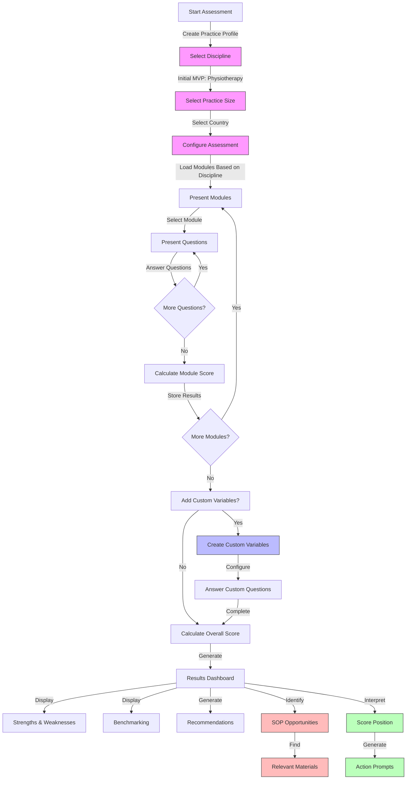
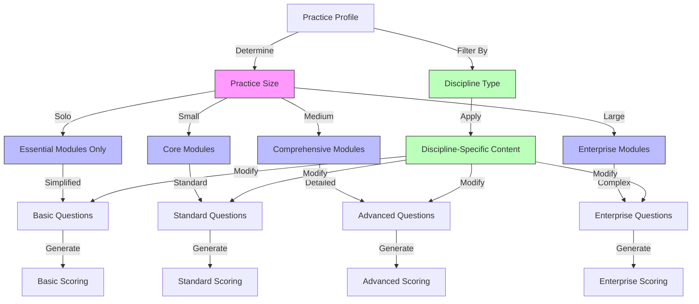
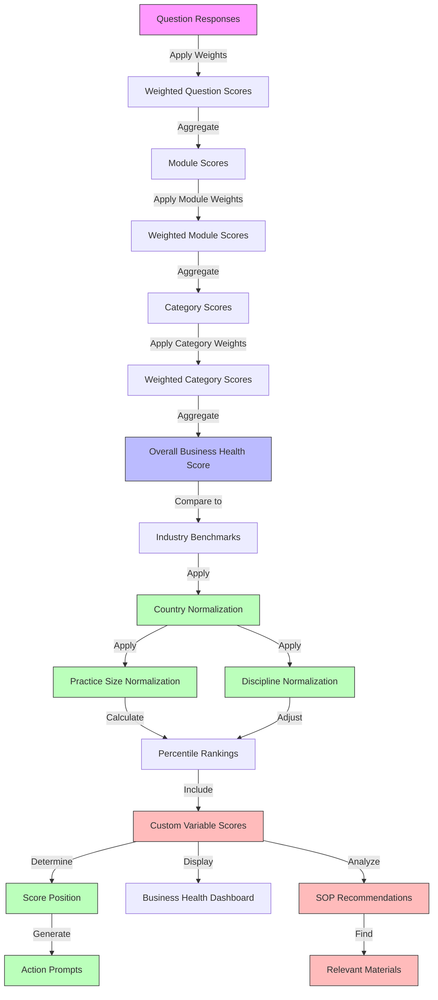
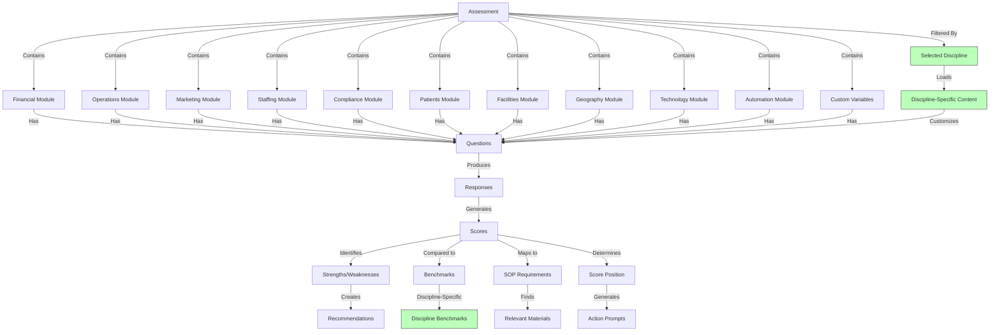

# Epic-1: Core Assessment Framework Development for Allied Health Practices
# Story-1j: Design Comprehensive Business Assessment - Structure and Diagrams

## Structure

```
/client
  /src
    /components
      /assessment
        QuestionRenderer.tsx
        ModuleNavigation.tsx
        ProgressTracker.tsx
        ScoreDisplay.tsx
        ResultsDashboard.tsx
        PracticeSizeSelector.tsx
        CountrySelector.tsx
        DisciplineSelector.tsx
        CustomVariableCreator.tsx
        SOPRecommendationDisplay.tsx
        ScoreInterpreter.tsx
        ActionPromptDisplay.tsx
        MaterialFinderInterface.tsx
    /types
      assessment.types.ts
      scoring.types.ts
      practice.types.ts
      country.types.ts
      discipline.types.ts
      custom.types.ts
      sop.types.ts
      interpretation.types.ts
      material.types.ts
    /constants
      questionCategories.ts
      moduleDefinitions.ts
      scoringConstants.ts
      countrySpecificData.ts
      disciplineSpecificData.ts
      practiceSizeScaling.ts
      sopTypes.ts
      scorePositions.ts
      actionPrompts.ts
      materialResources.ts
    /utils
      scoringCalculations.ts
      benchmarkComparison.ts
      practiceScaling.ts
      countryNormalization.ts
      disciplineAdapter.ts
      customVariableHandler.ts
      sopRelevanceMapper.ts
      scoreInterpreter.ts
      actionPromptGenerator.ts
      materialFinder.ts
    /plugins
      /disciplines
        physiotherapy.plugin.ts
        disciplineRegistry.ts
        baseDiscipline.interface.ts
/server
  /src
    /models
      Question.ts
      Module.ts
      AssessmentCategory.ts
      Score.ts
      PracticeProfile.ts
      Country.ts
      Discipline.ts
      CustomVariable.ts
      SOPType.ts
      ScorePosition.ts
      MaterialResource.ts
    /services
      QuestionService.ts
      ModuleService.ts
      ScoringService.ts
      BenchmarkService.ts
      PracticeProfileService.ts
      CountrySpecificService.ts
      DisciplineService.ts
      CustomVariableService.ts
      SOPRelevanceService.ts
      ScoreInterpretationService.ts
      ActionPromptService.ts
      MaterialFinderService.ts
      DisciplinePluginService.ts
```

## Diagrams

### Assessment Flow



### Scaling System



### Scoring System



### Module Relationship

