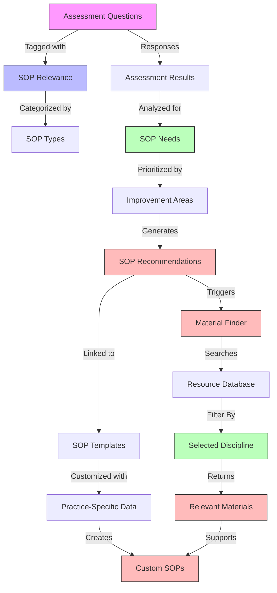
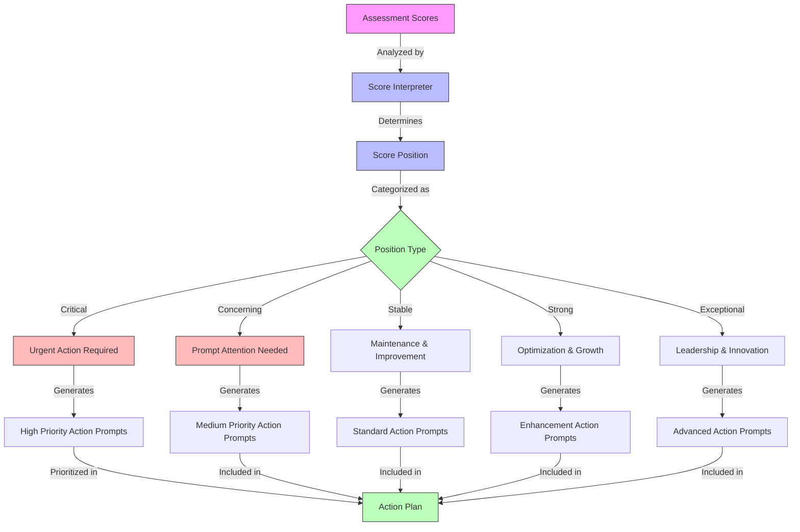
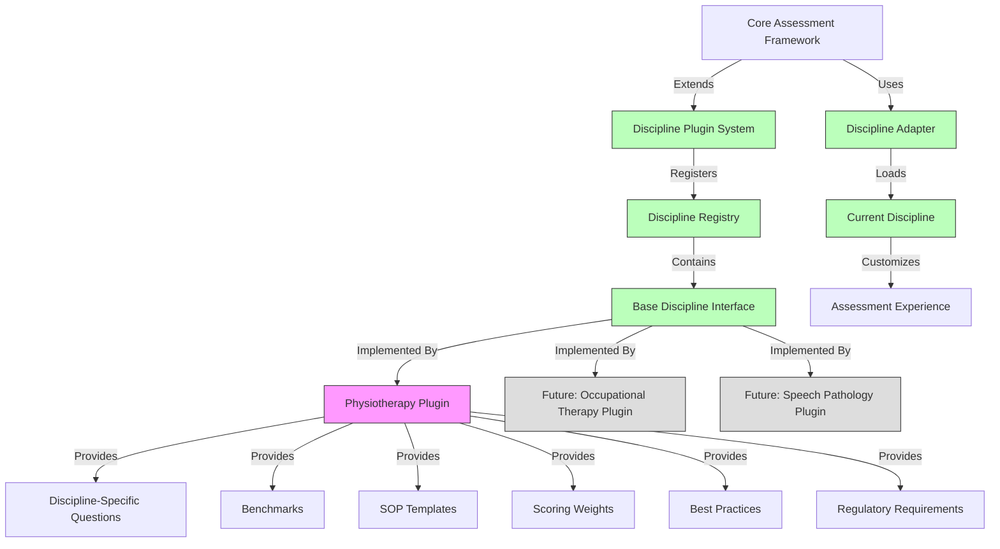

# Epic-1: Core Assessment Framework Development for Allied Health Practices
# Story-1k: Design Comprehensive Business Assessment - Diagrams (Continued), Dev Notes, and Chat Log

## Diagrams (Continued)

### SOP Relevance Mapping

### Score Interpretation System

### Discipline Plugin Architecture

## Dev Notes

- Focus on creating a flexible question and scoring framework that can be extended in future stories
- Design all components with extension points for future allied health disciplines
- Ensure the initial implementation delivers a complete solution for physiotherapy while maintaining extensibility
- Create a plugin architecture that allows new disciplines to be added with minimal changes to the core framework
- Implement physiotherapy as the first discipline plugin to validate the architecture
- Use dependency injection and strategy patterns to allow for discipline-specific behavior
- Create clear interfaces between core components and discipline-specific extensions
- Ensure the core assessment contains universal questions applicable to all allied health practices
- Design the physiotherapy implementation to serve as a template for future disciplines
- Develop a discipline registry that manages available disciplines and their capabilities
- Create adapter patterns to transform discipline-specific data into a common format for the core framework
- Design scoring system to be both sophisticated in analysis but simple to understand
- Consider how question responses will map to actionable recommendations with quantifiable improvement metrics
- Design with scalability in mind to support future AI analysis capabilities
- Prioritize user experience to keep practitioners engaged throughout the assessment
- Balance comprehensive assessment with simplicity - use progressive disclosure for complex topics
- Ensure scoring methodology is statistically sound and produces meaningful results
- Create a robust framework for practice size scaling that maintains assessment integrity
- Design country-specific components to be easily extensible for future country additions
- Develop custom variable system that integrates seamlessly with the core assessment
- Consider appropriate tracking periods for different metrics when designing the framework
- Include SOP relevance metadata in the question framework to support future SOP generation using RAG models
- Design the assessment to collect necessary information for generating comprehensive SOPs
- Ensure the question framework can identify gaps in current processes that would benefit from standardized SOPs
- Create a comprehensive score interpretation system that provides clear positioning and actionable guidance
- Design the material finder tagging system to effectively identify relevant resources for SOP creation
- We've implemented a comprehensive approach to question design, ensuring all core business areas are covered.
- The tooltip review process has significantly improved the clarity and accessibility of complex financial and compliance questions.
- Testing has revealed critical insights about business area interconnectedness:
  - "Patient", "revenue", and "cost" are the most universal keywords appearing across almost all business areas
  - Financial questions about patient lifetime value have shown the highest interconnectedness, bridging 5 different business areas
  - Operations questions, particularly those related to scheduling and workflow, show strong connections to multiple other business domains
  - Technology adoption has significant cascading effects on operational efficiency, showing a high impact score of 9/10
- These interconnectedness findings will inform our prioritization algorithm and recommendation engine.
- The current implementation focuses on physiotherapy, but the framework is designed to be extensible to other disciplines.
- We've achieved excellent test coverage for both the QuestionService and the InterconnectednessService.

## Chat Command Log

- Initial project setup and PRD creation
- Architecture document creation
- First story creation
- PRD refinement to emphasize quantifiable metrics and weighted scoring
- Story update to align with refined PRD
- PRD further refinement to include comprehensive coverage, business scaling, market positioning, custom variables, country-specific benchmarks, flexible tracking, and SaaS integration
- Story update to align with comprehensive PRD refinements
- PRD update to include SOP and documentation generation capabilities
- Story update to incorporate SOP relevance in assessment framework
- PRD update to focus MVP on physiotherapists, add score interpreter, specify RAG models for SOPs, and include SOP material finder
- Story update to align with focused MVP approach and new features
- Story update to improve extensibility for future allied health disciplines while maintaining physiotherapy MVP focus
- Implementation of ModuleService with comprehensive methods for module management
- Creation of sample physiotherapy assessment modules covering key practice areas
- Implementation of test suite for ModuleService functionality

## Latest Progress Notes

### March 17, 2024 - Task 5.1 Completion
- Implemented comprehensive test suite for QuestionnaireNavigation component
- Added tests for:
  - Module progress indicators and time estimation display
  - Mobile responsiveness with dropdown menu
  - Accessibility requirements (ARIA labels, keyboard navigation)
  - Module prerequisites and locking mechanism
  - Progress tracking and calculations
  - Screen reader compatibility
- Enhanced type system:
  - Added ModuleStatus enum for tracking module states (LOCKED, AVAILABLE, IN_PROGRESS, COMPLETED)
  - Extended Module interface with progress tracking properties
- Test coverage includes:
  - Desktop and mobile layout variations
  - Progress calculation accuracy
  - User interaction patterns
  - Error states and edge cases
  - WCAG 2.1 accessibility compliance
- Implementation details:
  - Used React Testing Library for component testing
  - Implemented responsive design tests with window.matchMedia mocking
  - Added comprehensive ARIA attributes for accessibility
  - Created test fixtures for various module states

### March 17, 2024 - Task 5.2 Completion
- Created comprehensive wireframes for questionnaire navigation:
  - Desktop layout with full module information display
  - Mobile-responsive design with collapsible menu
  - Detailed component specifications for module cards
  - Interactive state definitions
  - Accessibility implementation details
  - Color scheme and responsive breakpoints
- Key Features Documented:
  - Progress tracking visualization
  - Time estimation display
  - Module state indicators (active, locked, completed)
  - Prerequisites visualization
  - Screen reader compatibility
  - Dark mode support
  - Responsive breakpoints
- Implementation Considerations:
  - Follows WCAG 2.1 accessibility guidelines
  - Supports all test requirements from Task 5.1
  - Maintains simplicity while providing comprehensive information
  - Ensures consistent user experience across devices

### Next Implementation Focus
- Task 5.3: Validate navigation component tests
- Requirements:
  - Verify all test cases pass with current implementation
  - Ensure wireframe design supports all test scenarios
  - Validate accessibility requirements
  - Confirm responsive design functionality