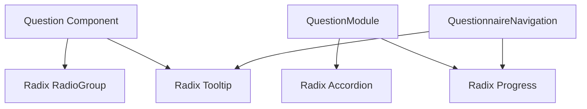

# Epic-1: Core Assessment Framework Development for Allied Health Practices
# Story-2: Migrate Assessment Components to Radix UI for Enhanced Accessibility and Consistency

## Story Description

**As a** developer
**I want** to migrate our custom UI components to Radix UI
**so that** we can provide a more accessible, consistent, and maintainable user interface

## Status

Draft

## Context

Currently, our assessment questionnaire uses custom HTML elements with basic CSS styling. While functional, this approach:
- Requires manual implementation of accessibility features
- May have inconsistencies across different components
- Lacks some advanced interactive features
- Requires more maintenance effort

Radix UI is already installed in our project with the following components:
- @radix-ui/react-accordion
- @radix-ui/react-icons
- @radix-ui/react-progress
- @radix-ui/react-radio-group
- @radix-ui/react-slot
- @radix-ui/react-tooltip

This migration will enhance our UI while maintaining existing functionality.

## Estimation

Story Points: 3 (3 days human development = 30 minutes AI development)

## Tasks

1. - [ ] Setup and Configuration
   1. - [ ] Write tests for Radix UI component integration
   2. - [ ] Create shared theme configuration for Radix UI components
   3. - [ ] Set up CSS variables for consistent styling
   4. - [ ] Create utility functions for common Radix UI patterns

2. - [ ] Question Component Migration
   1. - [ ] Write tests for new Radix UI Question component
   2. - [ ] Migrate radio buttons to @radix-ui/react-radio-group
   3. - [ ] Implement tooltip using @radix-ui/react-tooltip
   4. - [ ] Update numeric input styling
   5. - [ ] Update text area styling
   6. - [ ] Validate accessibility compliance
   7. - [ ] Update Question component tests

3. - [ ] QuestionModule Component Migration
   1. - [ ] Write tests for new Radix UI QuestionModule component
   2. - [ ] Migrate module expansion to @radix-ui/react-accordion
   3. - [ ] Update progress bar to @radix-ui/react-progress
   4. - [ ] Implement new animations
   5. - [ ] Validate accessibility compliance
   6. - [ ] Update QuestionModule component tests

4. - [ ] QuestionnaireNavigation Component Migration
   1. - [ ] Write tests for new Radix UI navigation component
   2. - [ ] Update module selection interface
   3. - [ ] Implement tooltips for locked modules
   4. - [ ] Update progress indicators
   5. - [ ] Enhance mobile menu interaction
   6. - [ ] Validate accessibility compliance
   7. - [ ] Update QuestionnaireNavigation component tests

5. - [ ] AssessmentPage Integration
   1. - [ ] Update AssessmentPage component to work with new components
   2. - [ ] Implement page-level animations
   3. - [ ] Add loading states
   4. - [ ] Write integration tests
   5. - [ ] Validate overall accessibility

6. - [ ] Documentation and Cleanup
   1. - [ ] Update component documentation
   2. - [ ] Create usage examples
   3. - [ ] Remove unused CSS
   4. - [ ] Update README with new component information

## Constraints

- Must maintain existing functionality
- Must pass all existing tests
- Must maintain or improve accessibility
- Must support mobile devices
- Must work with existing state management

## Data Models / Schema

No changes to data models required. This is a UI-only update.

## Structure

Components to be updated:
```
client/src/components/assessment/
├── Question.tsx
├── Question.css
├── QuestionModule.tsx
├── QuestionModule.css
├── QuestionnaireNavigation.tsx
└── QuestionnaireNavigation.css
```

New files to be created:
```
client/src/styles/
├── radix-theme.css
└── variables.css

client/src/components/ui/
├── RadioGroup.tsx
├── Tooltip.tsx
├── Progress.tsx
└── Accordion.tsx
```

## Diagrams



## Dev Notes

### Component Migration Strategy

1. Question Component:
   - Replace native radio inputs with Radix RadioGroup
   - Enhance help text with Radix Tooltip
   - Maintain existing onChange handlers
   - Add focus and hover animations

2. QuestionModule:
   - Replace custom expansion with Radix Accordion
   - Update progress bar with Radix Progress
   - Add smooth transitions

3. QuestionnaireNavigation:
   - Add tooltips for locked modules
   - Enhance mobile menu interaction
   - Improve progress visualization

### Testing Strategy

- Write new tests before migrating each component
- Maintain existing test coverage
- Add specific tests for Radix UI interactions
- Test accessibility using @testing-library/jest-dom

## Chat Command Log

- User: Update all required documents and plan Radix UI migration
- Agent: Creating new story for Radix UI migration 