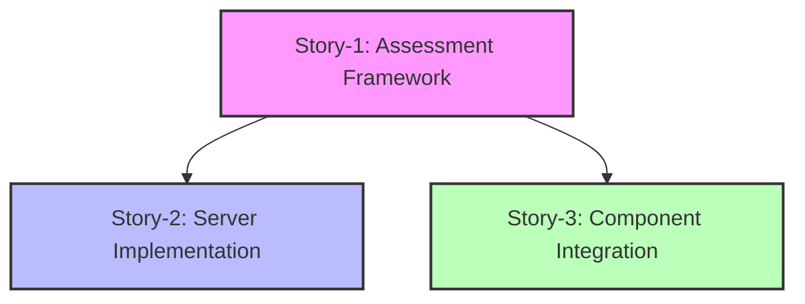

# Epic-1: Core Assessment Framework Development for Allied Health Practices

## Stories Overview

### Story-1: Design Comprehensive Business Assessment Questionnaire Structure
**Status**: In Progress  
**Story Points**: 6 (≈ 60 minutes of AI development time)

#### Summary
Development of a comprehensive business assessment framework for allied health practices, with initial focus on physiotherapy. This story establishes the foundation for the assessment system including:
- Weighted scoring system for quantifiable metrics
- Scalable questionnaire structure
- Data models and schema design
- UI wireframes and interaction flows
- Technical architecture and implementation patterns

#### Key Deliverables
- Complete question framework with assessment categories
- Weighted scoring system with practice size scaling
- Data models and schema design
- UI wireframes and prototypes
- Integration points for future SOP generation
- Documentation and technical specifications

### Story-2: Server-Side Business Logic and Integration Layer
**Status**: In Progress  
**Story Points**: 7 (≈ 70 minutes of AI development time)

#### Summary
Implementation of server-side components to handle complex business logic and integrations that complement the client-side assessment framework. This story focuses on:
- Assessment engine implementation
- Data processing services
- Integration layer development
- Performance optimization
- Security enhancement

#### Key Deliverables
- Scoring algorithm service
- Data aggregation and analysis system
- Supabase integration
- Performance optimizations
- Security implementations

### Story-3: AssessmentPage Component Integration
**Status**: In Progress  
**Story Points**: 5 (≈ 50 minutes of AI development time)

#### Summary
Integration of all assessment components into the AssessmentPage with proper phase and state management. This story addresses:
- Phase management system implementation
- State management enhancement
- Component integration
- Test coverage improvement
- Documentation updates

#### Key Deliverables
- Fully integrated AssessmentPage component
- Phase management system
- Centralized state management
- Component integration tests
- Updated documentation

## Story Dependencies

## Implementation Strategy

### Phase 1: Foundation (Story-1)
- Design and validate assessment structure
- Create data models and schemas
- Develop UI components and flows
- Establish scoring methodology
- Document technical requirements

### Phase 2: Server Implementation (Story-2)
- Implement assessment engine
- Develop data processing services
- Set up integration layer
- Optimize performance
- Enhance security

### Phase 3: Integration (Story-3)
- Implement phase management
- Enhance state management
- Complete component integration
- Improve test coverage
- Update documentation

## Technical Stack
- Frontend: TypeScript-based framework
- Backend: Node.js/Express.js
- Database: Supabase
- Testing: Jest
- Containerization: Docker (planned)

## Success Metrics
1. Complete assessment framework implementation
2. Functional scoring and analysis system
3. Performant server-side processing
4. Secure data handling
5. Comprehensive documentation
6. Passing test coverage
7. Meeting performance benchmarks
8. Fully integrated components

## Notes
- Stories are designed to work together seamlessly
- Story-1 provides the foundation for Stories 2 and 3
- Story-3 addresses integration blockers in Story-1
- All stories support future extensibility
- Focus on Australian market with international expansion capability
- RAG model integration throughout all stories
- Emphasis on maintainable and scalable architecture 