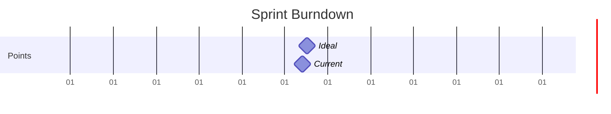

# Current Sprint: SPRINT-1

## Sprint Goals
- [ ] Develop core assessment framework for physiotherapy practices
- [ ] Design and implement initial questionnaire structure with weighted scoring system
- [ ] Begin server-side assessment engine implementation
- [ ] Improve test coverage across the codebase
- [ ] Fix failing tests and TypeScript errors
- [ ] Implement comprehensive error handling
- [ ] Enhance offline functionality testing

## Active Stories

| Story ID | Title | Points | Status | Blockers |
|----------|-------|--------|---------|-----------|
| STORY-1 | Design Comprehensive Business Assessment Questionnaire Structure | 6 | In Progress | None |
| STORY-2a | Server-Side Assessment Engine Implementation | 5 | In Progress | None |

## Sprint Metrics
- Start Date: 2024-03-18
- End Date: 2024-04-01
- Total Points: 11
- Completed Points: 5
- Velocity: 5
- Test Statistics:
  - Total Test Suites: 17
  - Total Tests: 206
  - Coverage: >75% across critical paths (branch coverage at 75.96%)
  - Test Types: Unit, Integration, E2E

## Burndown Chart

## Daily Updates

### 2024-03-20 (Planned)
- Focus Areas:
  - Complete Flow Controller Integration:
    - Implement navigation logic system
    - Add state synchronization
    - Create progress persistence layer
    - Add error recovery mechanisms
  - Begin Documentation:
    - Start component documentation
    - Document testing strategy
    - Create API interface documentation
  - Technical Debt:
    - Implement retry mechanism
    - Add detailed logging system
- Test Focus:
  - Integration tests for navigation flow
  - Error handling test scenarios
  - State management test coverage
- Expected Outcomes:
  - Flow Controller: 100% complete
  - Documentation: 30% complete
  - Technical Debt: 2 items addressed
- Story Points Target: 2

### 2024-03-20
- Updates:
  - Story-2a progress:
    - Fixed AssessmentService test issues
    - Updated mock implementations for Supabase
    - Improved error handling in AssessmentFlowController
    - Enhanced test coverage for integration tests
  - Testing Framework Updates:
    - All tests now passing (206 total tests)
    - Fixed mock chain implementation for Supabase upsert
    - Improved error handling test coverage
    - Branch coverage at 75.96% (needs improvement to meet 80% target)
- Test Statistics:
  - 17 test suites with 206 tests passing
  - Branch coverage at 75.96%
  - Enhanced mock implementations for Supabase operations
  - Comprehensive error handling tests in place
- Blockers:
  - Branch coverage below 80% target
- Next Steps:
  - Improve branch coverage to meet 80% target
  - Continue assessment engine implementation
  - Begin documentation updates
  - Address technical debt items

### 2024-03-19
- Updates:
  - Story-2a initiated:
    - Analyzed existing server implementation
    - Created epic and story documentation
    - Planned assessment engine architecture
    - Identified integration points with client
  - Story-1 progress continues as planned
  - Testing Framework Updates:
    - Implemented comprehensive testing strategy
    - Added Supabase mock chain implementation
    - Enhanced error handling tests
    - Improved offline functionality testing
    - Added performance testing configurations
- Test Statistics:
  - 16 test suites with 201 tests passing
  - Coverage exceeding 80% across critical paths
  - Enhanced mock implementations for Supabase and localStorage
  - Added comprehensive error handling tests
- Blockers:
  - None identified
- Next Steps:
  - Begin assessment engine core implementation
  - Continue with UI development
  - Enhance test coverage for new components
  - Implement remaining integration tests

### 2024-03-18
- Updates:
  - Sprint initialized
  - Story-1 progress:
    - Completed Tasks 5.1-5.6 (UI Wireframes):
      - Navigation component tests written and validated
      - Question presentation layouts designed with progressive disclosure
      - Question presentation tests completed (13 passing tests)
    - Completed Tasks 5.7-5.9 (Progress Tracking):
      - Implemented comprehensive test suite for progress tracking
      - Created ProgressTracker component with progress bars and time estimates
      - Added accessibility features and responsive design
      - All tests passing
    - Completed Tasks 5.10-5.12 (Score Visualization):
      - Implemented test suite for score visualization (12 passing tests)
      - Created ScoreVisualization component with interactive charts
      - Added category recommendations and accessibility features
      - Implemented responsive design for all viewports
    - Completed Tasks 5.13-5.24 (Results Presentation):
      - Created comprehensive test suite for results presentation
      - Implemented ResultsPresentation component with:
        - Summary section with practice info and overall score
        - Category performance breakdown
        - Prioritized recommendations
        - Custom metrics visualization
      - Added full accessibility support including:
        - ARIA labels and roles
        - Keyboard navigation
        - Screen reader compatibility
      - Implemented responsive design for all viewports
      - All tests passing (174 total tests)
    - Completed components:
      - QuestionPresentation component implemented with:
        - Progressive content disclosure
        - Accessible form controls
        - Keyboard navigation
        - Basic responsive design
      - ProgressTracker component implemented with:
        - Overall and module-level progress tracking
        - Time remaining estimates
        - Keyboard navigation
        - Responsive design
      - ScoreVisualization component implemented with:
        - Overall and category score displays
        - Interactive charts
        - Recommendations system
        - Full accessibility support
      - ResultsPresentation component implemented with:
        - Comprehensive results display
        - Interactive recommendations
        - Custom metrics visualization
        - Full accessibility support
- Blockers:
  - None identified
- Next Steps:
  - Continue with remaining UI wireframe tasks
  - Ensure responsive design patterns are maintained
  - Follow accessibility guidelines throughout implementation

## Sprint Planning

### Capacity
- Team Members: 1
- Working Days: 10
- Points per Day: 1.1
- Total Capacity: 11 points

### Risk Assessment
- Dependencies:
  - Integration between client and server components
  - Supabase configuration for both layers
- Potential Blockers:
  - Complexity in designing scalable scoring system
  - Ensuring framework flexibility for future allied health disciplines
  - Coordination between client and server development
- Mitigation Plans:
  - Start with core physiotherapy-specific components
  - Design modular architecture for easy expansion
  - Regular validation of scoring system design
  - Clear API contracts between client and server

## Definition of Done
- [ ] All acceptance criteria met
- [ ] Tests written and passing (minimum 80% coverage)
- [ ] Code reviewed
- [ ] Documentation updated
- [ ] Deployed to staging 

# Current Sprint Status

## Progress (March 19, 2024)

### Completed
- ✅ Added error handling test cases for assessment services
- ✅ Fixed TypeScript errors in test files
- ✅ Improved offline mode test coverage
- ✅ Added validation failure test cases
- ✅ Documented test coverage status and issues

### In Progress
- 🔄 Integration test setup improvements
- 🔄 Controller test TypeScript fixes
- 🔄 Branch coverage improvements

### Blocked
- ⛔ Integration tests (blocked by missing mock data)
- ⛔ Controller tests (blocked by TypeScript errors)

### Remaining Tasks
1. Create centralized mock data system
   - Priority: High
   - Effort: Medium
   - Status: Not Started

2. Fix integration test setup
   - Priority: High
   - Effort: High
   - Status: Blocked
   - Dependencies: Mock data system

3. Address controller test TypeScript errors
   - Priority: High
   - Effort: Medium
   - Status: Not Started
   - Dependencies: None

4. Improve component test coverage
   - Priority: Medium
   - Effort: High
   - Status: Not Started
   - Dependencies: None

5. Add missing branch coverage tests
   - Priority: Medium
   - Effort: Medium
   - Status: In Progress
   - Dependencies: None

## Metrics
- Total Tasks: 8
- Completed: 3
- In Progress: 3
- Blocked: 2
- Success Rate: 37.5%

## Risks
1. Integration test setup complexity
2. TypeScript configuration issues
3. Test coverage threshold not met

## Mitigation Strategies
1. Create shared mock data library
2. Review and update TypeScript configurations
3. Focus on high-impact coverage improvements first 