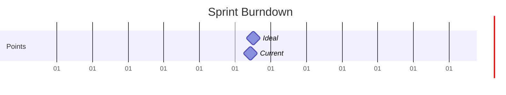

# Current Sprint: SPRINT-1

## Sprint Goals
- [ ] Develop core assessment framework for physiotherapy practices
- [ ] Design and implement initial questionnaire structure with weighted scoring system
- [ ] Begin server-side assessment engine implementation

## Active Stories

| Story ID | Title | Points | Status | Blockers |
|----------|-------|--------|---------|-----------|
| STORY-1 | Design Comprehensive Business Assessment Questionnaire Structure | 6 | In Progress | None |
| STORY-2a | Server-Side Assessment Engine Implementation | 5 | Planning | None |

## Sprint Metrics
- Start Date: 2024-03-18
- End Date: 2024-04-01
- Total Points: 11
- Completed Points: 4
- Velocity: 4

## Burndown Chart

## Daily Updates

### 2024-03-19
- Updates:
  - Story-2a initiated:
    - Analyzed existing server implementation
    - Created epic and story documentation
    - Planned assessment engine architecture
    - Identified integration points with client
  - Story-1 progress continues as planned
- Blockers:
  - None identified
- Next Steps:
  - Begin assessment engine core implementation
  - Continue with UI development
  - Plan integration testing strategy

### 2024-03-18
- Updates:
  - Sprint initialized
  - Story-1 progress:
    - Completed Tasks 5.1-5.6 (UI Wireframes):
      - Navigation component tests written and validated
      - Question presentation layouts designed with progressive disclosure
      - Question presentation tests completed (13 passing tests)
    - Completed Tasks 5.7-5.9 (Progress Tracking):
      - Implemented comprehensive test suite for progress tracking
      - Created ProgressTracker component with progress bars and time estimates
      - Added accessibility features and responsive design
      - All tests passing
    - Completed Tasks 5.10-5.12 (Score Visualization):
      - Implemented test suite for score visualization (12 passing tests)
      - Created ScoreVisualization component with interactive charts
      - Added category recommendations and accessibility features
      - Implemented responsive design for all viewports
    - Completed Tasks 5.13-5.24 (Results Presentation):
      - Created comprehensive test suite for results presentation
      - Implemented ResultsPresentation component with:
        - Summary section with practice info and overall score
        - Category performance breakdown
        - Prioritized recommendations
        - Custom metrics visualization
      - Added full accessibility support including:
        - ARIA labels and roles
        - Keyboard navigation
        - Screen reader compatibility
      - Implemented responsive design for all viewports
      - All tests passing (174 total tests)
    - Completed components:
      - QuestionPresentation component implemented with:
        - Progressive content disclosure
        - Accessible form controls
        - Keyboard navigation
        - Basic responsive design
      - ProgressTracker component implemented with:
        - Overall and module-level progress tracking
        - Time remaining estimates
        - Keyboard navigation
        - Responsive design
      - ScoreVisualization component implemented with:
        - Overall and category score displays
        - Interactive charts
        - Recommendations system
        - Full accessibility support
      - ResultsPresentation component implemented with:
        - Comprehensive results display
        - Interactive recommendations
        - Custom metrics visualization
        - Full accessibility support
- Blockers:
  - None identified
- Next Steps:
  - Continue with remaining UI wireframe tasks
  - Ensure responsive design patterns are maintained
  - Follow accessibility guidelines throughout implementation

## Sprint Planning

### Capacity
- Team Members: 1
- Working Days: 10
- Points per Day: 1.1
- Total Capacity: 11 points

### Risk Assessment
- Dependencies:
  - Integration between client and server components
  - Supabase configuration for both layers
- Potential Blockers:
  - Complexity in designing scalable scoring system
  - Ensuring framework flexibility for future allied health disciplines
  - Coordination between client and server development
- Mitigation Plans:
  - Start with core physiotherapy-specific components
  - Design modular architecture for easy expansion
  - Regular validation of scoring system design
  - Clear API contracts between client and server

## Definition of Done
- [ ] All acceptance criteria met
- [ ] Tests written and passing
- [ ] Code reviewed
- [ ] Documentation updated
- [ ] Deployed to staging 