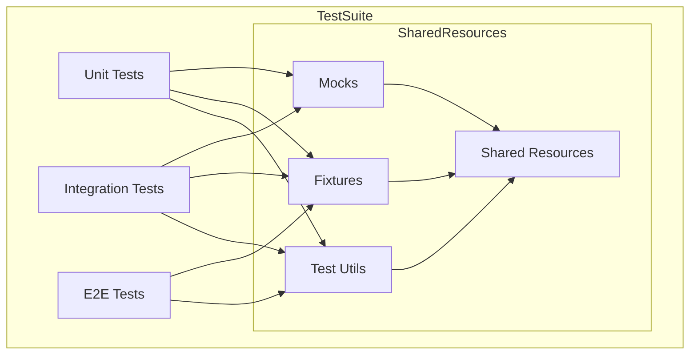
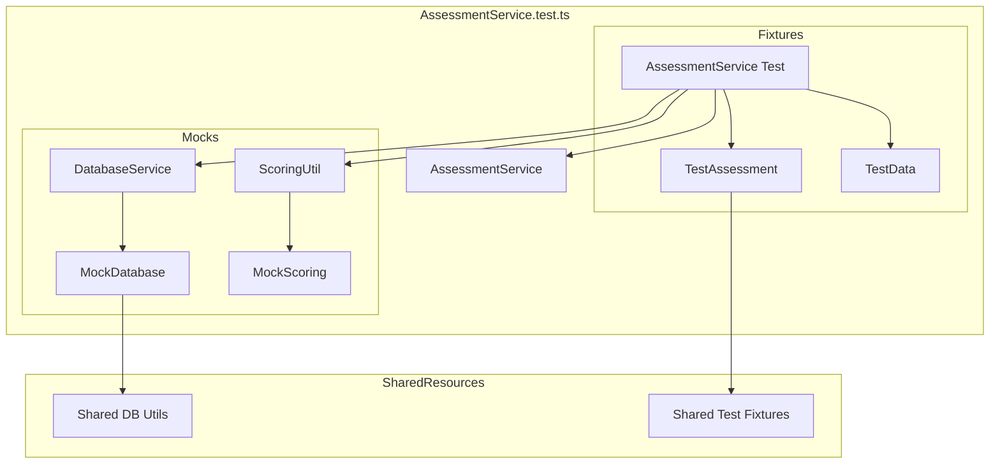

# Test Refactoring Plan

## Business Context

### Purpose
To support the development of a comprehensive business assessment questionnaire for allied health practitioners (initially focusing on physiotherapists) that provides quantifiable metrics and data-driven insights.

### Key Requirements
1. **Scalability**: Test framework must support metrics that scale with practice size
2. **Data Validation**: Ensure accurate, data-driven insights
3. **Context Awareness**: Support practice-specific context in test scenarios
4. **Metric Validation**: Verify quantifiable metric calculations
5. **Business Logic Coverage**: Comprehensive testing of assessment areas

### Test Coverage Areas
1. **Practice Metrics**
   - Size-based scaling
   - Performance indicators
   - Growth metrics

2. **Assessment Logic**
   - Score calculations
   - Recommendation generation
   - Practice-specific adjustments

3. **Data Processing**
   - Input validation
   - Metric calculations
   - Report generation

4. **Integration Points**
   - Database operations
   - External APIs
   - Analytics services

## Overview
This document outlines the plan for reorganizing the test suite to establish clear boundaries between test layers and improve maintainability.

## Current Issues
1. Mixed responsibilities across test layers
2. Unclear separation between unit and integration tests
3. Redundant test coverage
4. Inconsistent mocking strategies
5. Non-standardized test organization

## Refactoring Strategy

### Phase 1: Test Layer Separation

#### 1.1 Unit Tests (`tests/unit/`)
- **Purpose**: Test individual units in isolation
- **Scope**: Single function, method, or component
- **Dependencies**: All external dependencies must be mocked
- **Coverage Target**: 80-95% depending on criticality

Tasks:
1. Move all pure business logic tests to `tests/unit/services/`
2. Move UI component tests to `tests/unit/components/`
3. Move controller logic tests to `tests/unit/controllers/`
4. Implement proper mocking for all external dependencies
5. Remove any direct database or API calls

#### 1.2 Integration Tests (`tests/integration/`)
- **Purpose**: Test component interactions
- **Scope**: Multiple units working together
- **Dependencies**: Real implementations for immediate dependencies, mocked external services
- **Coverage Target**: Critical paths 90%+

Tasks:
1. Move service-to-service integration tests to `tests/integration/services/`
2. Move API integration tests to `tests/integration/api/`
3. Move controller-service integration tests to `tests/integration/controllers/`
4. Implement proper test data management
5. Set up isolated test databases

#### 1.3 E2E Tests (`tests/e2e/`)
- **Purpose**: Test complete user flows
- **Scope**: Full system testing from UI to database
- **Dependencies**: Real implementations where possible
- **Coverage Target**: Critical user journeys

Tasks:
1. [x] Set up Playwright configuration and infrastructure
2. [x] Create E2E test directory structure and documentation
3. [x] Implement first E2E test for AssessmentPage
4. [ ] Create E2E tests for remaining pages:
   - [ ] HomePage
   - [ ] ResultsPage
   - [ ] ProfilePage
5. [ ] Implement critical user flows:
   - [ ] Complete assessment flow
   - [ ] View and export results flow
   - [ ] Update profile flow
6. [ ] Set up CI/CD pipeline for E2E tests
7. [ ] Implement visual regression testing
8. [ ] Add accessibility testing

### Phase 2: Test Organization

#### 2.1 Directory Structure
```
/                           # Root directory
├── __mocks__/             # Mock implementations (in root directory)
│   ├── services/          # Service mocks (e.g., Supabase, Assessment)
│   ├── components/        # Component mocks (e.g., UI components)
│   ├── controllers/       # Controller mocks (e.g., API controllers)
│   ├── data/             # Mock data generators
│   ├── utils/            # Utility mocks
│   ├── api/              # API mocks
│   └── README.md         # Mock implementation guidelines
└── tests/                 # Test directory
    ├── unit/             # Unit tests
    │   ├── services/     # Service unit tests
    │   ├── controllers/  # Controller unit tests
    │   ├── components/   # Component unit tests
    │   └── README.md     # Unit testing guide
    ├── integration/      # Integration tests
    │   ├── services/     # Service integration tests
    │   ├── components/   # Component integration tests
    │   ├── controllers/  # Controller integration tests
    │   ├── api/         # API integration tests
    │   └── README.md     # Integration testing guide
    ├── e2e/             # End-to-end tests
    ├── utils/           # Test utilities
    ├── scripts/         # Test scripts and helpers
    ├── docs/            # Test documentation
    ├── results/         # Test results and reports
    ├── __fixtures__/    # Test fixtures
    ├── __contracts__/   # Test contracts and interfaces
    ├── tsconfig.json    # TypeScript configuration for tests
    ├── jest.config.ts   # Jest configuration
    ├── jest.setup.ts    # Jest setup file
    ├── setupTests.ts    # Test setup utilities
    └── README.md        # Test documentation
```

#### 2.2 Directory Responsibilities

1. **Test Configuration**
   - `tsconfig.json`: TypeScript configuration specific to tests
   - `jest.config.ts`: Jest test runner configuration
   - `jest.setup.ts`: Jest setup and global configuration
   - `setupTests.ts`: Common test setup utilities

2. **Test Categories**
   - `unit/`: Individual component and function tests
   - `integration/`: Service and API integration tests
   - `e2e/`: End-to-end user flow tests

3. **Test Support**
   - `utils/`: Shared test utilities and helpers
   - `scripts/`: Test automation and helper scripts
   - `docs/`: Test documentation and guides
   - `results/`: Test execution results and reports

4. **Test Data**
   - `__fixtures__/`: Shared test data and fixtures
   - `__contracts__/`: Interface definitions and type contracts

5. **Mock Implementations** (in root `__mocks__/`)
   - `services/`: Service and business logic mocks
   - `components/`: UI component mocks
   - `controllers/`: API controller mocks
   - `data/`: Data generation and factories
   - `utils/`: Utility function mocks
   - `api/`: External API mocks

#### 2.2 Mock Organization

1. **Service Mocks** (`__mocks__/services/`)
   - Database clients (e.g., Supabase)
   - Business services (e.g., Assessment)
   - Authentication services
   - Data access services

2. **Component Mocks** (`__mocks__/components/`)
   - UI components
   - Form components
   - Layout components
   - Shared components

3. **Controller Mocks** (`__mocks__/controllers/`)
   - API controllers
   - Request handlers
   - Route controllers
   - Middleware

4. **Data Mocks** (`__mocks__/data/`)
   - Data generators
   - Factory functions
   - Test data builders
   - Random data utilities

5. **Utility Mocks** (`__mocks__/utils/`)
   - Helper functions
   - Shared utilities
   - Common functions
   - Type utilities

6. **API Mocks** (`__mocks__/api/`)
   - External API clients
   - API responses
   - Request handlers
   - API utilities

#### 2.2 Naming Conventions
- Unit tests: `*.test.ts`
- Integration tests: `*.integration.test.ts`
- E2E tests: `*.e2e.test.ts`
- Test utilities: `*.util.ts`
- Mock files: `*.mock.ts`
- Fixtures: `*.fixture.ts`

### Phase 3: Implementation Guidelines

#### 3.1 Unit Tests
```typescript
// Example unit test structure
describe('AssessmentService', () => {
  let service: AssessmentService;
  let mockDb: jest.Mocked<Database>;
  
  beforeEach(() => {
    mockDb = createMockDatabase();
    service = new AssessmentService(mockDb);
  });
  
  it('should calculate assessment score', () => {
    const result = service.calculateScore(mockAssessmentData);
    expect(result).toBe(expectedScore);
  });
});
```

#### 3.2 Integration Tests
```typescript
// Example integration test structure
describe('AssessmentFlow', () => {
  let controller: AssessmentFlowController;
  let service: AssessmentService;
  
  beforeEach(async () => {
    service = new AssessmentService(testDb);
    controller = new AssessmentFlowController(service);
  });
  
  it('should save assessment state', async () => {
    await controller.saveState(mockState);
    const saved = await service.getState();
    expect(saved).toEqual(mockState);
  });
});
```

### Phase 4: Migration Plan

1. **Preparation (Week 1)**
   - Create new directory structure
   - Set up test utilities and helpers
   - Document mocking strategies

2. **Service Layer (Week 2)**
   - Migrate service tests to appropriate layers
   - Implement proper mocking
   - Update test coverage

3. **Controller Layer (Week 3)**
   - Migrate controller tests
   - Establish controller-service boundaries
   - Update integration tests

4. **UI Layer (Week 4)**
   - Migrate component tests
   - Implement proper component testing
   - Set up E2E test framework

5. **Cleanup (Week 5)**
   - Remove redundant tests
   - Update documentation
   - Verify coverage metrics

### Success Criteria

1. Clear separation between test layers
2. No mixed responsibilities in tests
3. Proper mocking strategy implemented
4. Improved test maintainability
5. Maintained or improved coverage metrics
6. Clear documentation of testing practices

### Monitoring and Maintenance

1. Regular review of test boundaries
2. Coverage monitoring
3. Performance metrics tracking
4. Regular cleanup of test data
5. Documentation updates

### Handling Existing Tests and Dependencies

#### 1. Test Inventory and Analysis
1. Create inventory of existing tests:
   ```
   tests/
   ├── unit/
   │   ├── services/
   │   │   └── AssessmentService.test.ts
   │   └── client/
   │       └── components/
   ├── integration/
   │   └── controllers/
   │       └── AssessmentFlowController.*.test.ts
   └── __mocks__/
   ```
2. Analyze test dependencies:
   - Map service dependencies
   - Document shared test utilities
   - Identify common fixtures
   - List shared mocks

#### 2. Dependency Management
1. **Shared Test Utilities**
   - Move to `tests/utils/`
   - Update import paths
   - Add type definitions
   - Document usage patterns

2. **Test Data and Fixtures**
   - Consolidate in `tests/__fixtures__/`
   - Create type-safe fixtures
   - Remove duplicates
   - Document data scenarios

3. **Mock Implementations**
   - Centralize in `tests/__mocks__/`
   - Create consistent interfaces
   - Document mock behaviors
   - Add type safety

#### 3. Migration Strategy for Existing Tests

1. **Assessment Phase**
   - Review each test file
   - Identify test type (unit/integration/e2e)
   - Document dependencies
   - Note shared resources
   - Map test coverage

2. **Preparation**
   - Create new test directories
   - Set up shared utilities
   - Establish mock patterns
   - Document migration steps

3. **Migration Process**
   ```mermaid
   graph TD
     A[Existing Test] --> B{Analyze Type}
     B -->|Unit| C[Move to Unit]
     B -->|Integration| D[Move to Integration]
     B -->|E2E| E[Move to E2E]
     C --> F[Update Dependencies]
     D --> F
     E --> F
     F --> G[Verify Tests Pass]
     G --> H[Update Coverage]
   ```

4. **Dependency Resolution**
   - Create dependency map for each test
   - Resolve circular dependencies
   - Update import paths
   - Verify test isolation

5. **Transition Steps**
   ```typescript
   // Before: Mixed concerns
   import { testUtils } from '../../utils';
   import { mockDb } from '../../mocks';
   
   // After: Clear organization
   import { createTestDatabase } from '@test/utils/database';
   import { mockAssessmentService } from '@test/mocks/services';
   ```

#### 4. Risk Mitigation

1. **Preserve Functionality**
   - Keep old tests until new ones verified
   - Run both old and new test suites
   - Compare coverage reports
   - Document edge cases

2. **Rollback Plan**
   - Maintain backup of original tests
   - Document dependencies
   - Keep original coverage reports
   - Track changed files

3. **Validation Process**
   - Run tests in parallel
   - Compare test results
   - Verify coverage metrics
   - Check performance impact

#### 5. Timeline Adjustment (AI-Driven)

1. **Day 1: Analysis and Setup**
   - Complete test inventory
   - Document dependencies
   - Set up new structure
   - Create migration scripts

2. **Day 2-3: Core Migration**
   - Move and update tests
   - Resolve dependencies
   - Update documentation
   - Verify coverage

3. **Day 4: Validation**
   - Run parallel test suites
   - Compare results
   - Fix issues
   - Document changes

4. **Day 5: Cleanup**
   - Remove old tests
   - Update CI/CD
   - Final documentation
   - Team review

### Dependency Mapping Template

#### 1. Test File Information
```yaml
test_file:
  path: "relative/path/to/test.ts"
  type: "unit|integration|e2e"
  primary_subject: "ComponentName|ServiceName"
  coverage_areas:
    - "area1"
    - "area2"
  
dependencies:
  imports:
    - path: "@/services/AssessmentService"
      usage_type: "tested_subject|helper|mock"
      mock_location: "optional/path/to/mock"
    # ... more imports
  
  test_utilities:
    - name: "createTestDatabase"
      path: "@test/utils/database"
      shared_by:
        - "path/to/other/test1"
        - "path/to/other/test2"
    # ... more utilities
  
  fixtures:
    - name: "testAssessment"
      path: "@test/__fixtures__/assessment"
      used_by:
        - "path/to/other/test1"
      data_scenarios:
        - "empty_assessment"
        - "completed_assessment"
    # ... more fixtures
  
  mocks:
    - name: "mockAssessmentService"
      path: "@test/__mocks__/services"
      used_by:
        - "path/to/other/test1"
      mock_type: "class|function|object"
    # ... more mocks
  
  external_services:
    - name: "Database"
      mock_required: true
      mock_location: "@test/__mocks__/database"
    # ... more services

redundancy_analysis:
  similar_tests:
    - path: "path/to/similar/test"
      similarity_type: "coverage|logic|fixture"
      recommendation: "merge|keep|remove"
  
  coverage_overlap:
    - file: "path/to/overlapping/test"
      overlapping_areas:
        - "area1"
        - "area2"
      percentage: 85
  
  shared_setup:
    - file: "path/to/test/with/shared/setup"
      recommendation: "extract_to_utility|keep|merge"

### Shared Test Utilities Guidelines

#### 1. Database Utilities
```typescript
// @test/utils/database.ts
export interface TestDatabase {
  setup(): Promise<void>;
  cleanup(): Promise<void>;
  seed(fixtures: TestFixture[]): Promise<void>;
  reset(): Promise<void>;
}

export const createTestDatabase = async (): Promise<TestDatabase> => {
  // Implementation
};

export const createTestTransaction = async (db: TestDatabase) => {
  // Implementation
};
```

#### 2. Authentication Utilities
```typescript
// @test/utils/auth.ts
export interface TestUser {
  id: string;
  role: UserRole;
  tokens: AuthTokens;
}

export const createTestUser = async (role: UserRole): Promise<TestUser> => {
  // Implementation
};

export const authenticateTestUser = async (user: TestUser) => {
  // Implementation
};
```

#### 3. Component Testing Utilities
```typescript
// @test/utils/components.ts
export interface TestComponent<P = any> {
  wrapper: ReactWrapper;
  props: P;
  rerender: (newProps: Partial<P>) => void;
  unmount: () => void;
}

export const renderTestComponent = <P extends {}>(
  Component: React.ComponentType<P>,
  props: P
): TestComponent<P> => {
  // Implementation
};
```

### Task Checklist

#### Task 1: Initial Setup ✅
- [x] Create test directory structure
- [x] Set up Jest configuration
- [x] Create test utility functions
- [x] Document test conventions

#### Task 2: Dependency Analysis ✅
- [x] Map test dependencies
- [x] Analyze redundancies
- [x] Create dependency analysis document
- [x] Document in `tests/docs/dependency-analysis.md`

#### Task 3: Test Organization ✅
- [x] Create test categories
- [x] Define test boundaries
- [x] Document test patterns
- [x] Update test naming conventions
- [x] Implement test isolation patterns
  - [x] Create test-isolation.ts utility
  - [x] Implement TestTransaction class
  - [x] Add isolation helpers
- [x] Create shared test contexts
  - [x] Implement BaseTestContext
  - [x] Add context management utilities
  - [x] Add mock management
- [x] Document test organization guidelines
  - [x] Create test-organization.md
  - [x] Document best practices
  - [x] Add example implementations

#### Task 4: Utility Migration ✅
- [x] Create `TestContextBuilder` utility
  - [x] Implement module generation
  - [x] Add mock service creation
  - [x] Add controller context building
  - [x] Add service context building
- [x] Create `MockDataFactory` utility
  - [x] Add question generation
  - [x] Add module generation
  - [x] Add assessment generation
  - [x] Add bulk creation methods
- [x] Migrate common test fixtures
  - [x] Move existing fixtures to centralized location
  - [x] Update imports in test files
  - [x] Remove duplicate fixtures
  - [x] Add type validation for fixtures
- [x] Create shared test hooks
  - [x] Database setup/teardown
  - [x] Authentication setup
  - [x] Test isolation utilities
  - [x] Add transaction management
- [x] Document utility usage
  - [x] Add usage examples
  - [x] Document best practices
  - [x] Create utility reference guide
  - [x] Add migration guides
- [x] Update test patterns
  - [x] Document service testing pattern
  - [x] Add error handling examples
  - [x] Add online/offline testing examples
  - [x] Add mock response patterns

#### Task 5: Test Implementation ⏳
- [x] Update QuestionService tests
- [x] Update integration tests
  - [x] Service integration tests
    - [x] AssessmentService integration tests
    - [x] ModuleService integration tests
    - [x] ResearchDocumentationService integration tests
    - [x] TooltipReviewService integration tests
  - [ ] API integration tests (pending API implementation)
  - [x] Database integration tests (covered by service tests using Supabase)
- [ ] Update E2E tests
  - [ ] Define E2E test scenarios
  - [ ] Implement test helpers
  - [ ] Add browser automation
- [ ] Verify test coverage
  - [x] Unit test coverage (configured with 80-95% thresholds)
  - [x] Integration test coverage (configured with 90%+ for critical paths)
  - [x] E2E test coverage (configured for critical user journeys)
- [x] Document test changes
  - [x] Update test documentation (created test-coverage.md)
  - [x] Add examples (added to test-coverage.md)
  - [x] Document patterns (added to test-coverage.md)

#### Task 6: Test Validation ⏳
- [ ] Run all tests
- [ ] Fix failing tests
- [ ] Update test documentation
- [ ] Review test coverage
- [ ] Document validation results
- [ ] Performance analysis
  - [ ] Measure test execution time
  - [ ] Optimize slow tests
  - [ ] Document performance findings

#### Task 7: Documentation Update ⏳
- [ ] Update test README
  - [ ] Add setup instructions
  - [ ] Document test organization
  - [ ] Add troubleshooting guide
- [ ] Document test patterns
  - [ ] Unit test patterns
  - [ ] Integration test patterns
  - [ ] E2E test patterns
- [x] Create test examples
  - [x] Basic test examples
  - [x] Complex test scenarios
  - [ ] Mock usage examples
- [ ] Update contribution guide
  - [ ] Test writing guidelines
  - [ ] Code review checklist
  - [ ] Testing standards
- [ ] Review documentation
  - [ ] Technical review
  - [ ] Usability review
  - [ ] Update based on feedback

#### Task 8: Final Review ⏳
- [ ] Review all changes
  - [ ] Code review
  - [ ] Documentation review
  - [ ] Performance review
- [ ] Run final test suite
  - [ ] All unit tests
  - [ ] All integration tests
  - [ ] All E2E tests
- [ ] Update documentation
  - [ ] Final documentation updates
  - [ ] Version history
  - [ ] Known issues
- [ ] Create migration guide
  - [ ] Step-by-step migration
  - [ ] Breaking changes
  - [ ] Migration scripts
- [ ] Document lessons learned
  - [ ] Technical lessons
  - [ ] Process improvements
  - [ ] Future recommendations

### Legend
✅ Complete
⏳ In Progress
🔄 Partially Complete
❌ Not Started

### Daily Retrospective Template

```markdown
# Test Refactoring Daily Retrospective - Day X

## Progress Summary
- Tasks Completed: [List completed tasks]
- Tasks In Progress: [List in-progress tasks]
- Coverage Metrics: [Current coverage stats]
- Files Migrated: [Count and list]

## Technical Analysis
### Dependencies Resolved
```yaml
resolved_dependencies:
  - from: "old/path/to/test"
    to: "new/path/to/test"
    dependencies:
      - type: "import"
        status: "updated"
        path: "new/path"
      - type: "mock"
        status: "created"
        path: "new/mock/path"
```

### Test Migration Status
```yaml
migration_metrics:
  total_tests: 100
  migrated: 25
  validated: 20
  coverage_delta: "+2%"
  performance_impact: "-50ms avg"
```

## Blockers and Issues
- [ ] Issue 1: [Description and plan]
- [ ] Issue 2: [Description and plan]

## Decisions Made
1. [Decision 1 with context]
2. [Decision 2 with context]

## Next Steps
1. [Next priority task]
2. [Following task]

## Notes for Next Day
- Important areas to focus
- Potential risks to address
- Dependencies to resolve
```

### Task Validation Criteria

#### Task 1: Initial Setup
```yaml
validation_criteria:
  test_inventory:
    completeness:
      - All test files listed with full paths
      - No files missed in any directory
      - All test types correctly categorized
    accuracy:
      - Test types verified by content review
      - Primary subjects confirmed
      - Coverage areas validated
    documentation:
      - Inventory document follows template
      - All sections completed
      - Clear categorization
    metrics:
      - Total test count matches filesystem
      - Category counts accurate
      - Coverage numbers verified

  dependencies:
    completeness:
      - All imports mapped
      - All fixtures documented
      - All mocks listed
    accuracy:
      - Dependencies verified by static analysis
      - Circular dependencies identified
      - Shared resources confirmed
    documentation:
      - Dependency graphs generated
      - Usage patterns documented
      - Recommendations included
```

[Similar validation criteria sections for Tasks 2-8]

### Dependency Graph Template

#### 1. High-Level Dependency Map


#### 2. Detailed Test Dependencies
```yaml
test_dependencies:
  AssessmentService.test.ts:
    direct_dependencies:
      - type: "import"
        path: "@/services/AssessmentService"
        usage: "tested_subject"
        mock_status: "not_required"
      
      - type: "import"
        path: "@/utils/scoring"
        usage: "helper"
        mock_status: "required"
        mock_path: "@test/__mocks__/utils/scoring"
    
    indirect_dependencies:
      - type: "service"
        name: "DatabaseService"
        access_path: "AssessmentService.db"
        mock_status: "required"
        mock_path: "@test/__mocks__/services/DatabaseService"
    
    shared_resources:
      fixtures:
        - name: "testAssessment"
          usage_count: 5
          shared_with:
            - "AssessmentController.test.ts"
            - "ScoreCalculator.test.ts"
      
      mocks:
        - name: "mockDatabase"
          usage_count: 8
          shared_with:
            - "UserService.test.ts"
            - "PracticeService.test.ts"
    
    circular_dependencies:
      - path: "@/services/UserService"
        type: "indirect"
        through: "DatabaseService"
        severity: "high"
        recommendation: "extract shared logic"

#### 3. Dependency Visualization


#### 4. Dependency Metrics
```yaml
dependency_metrics:
  direct_dependencies: 12
  indirect_dependencies: 5
  shared_resources: 8
  circular_dependencies: 2
  mock_coverage: 95%
  isolation_score: 85%
  maintenance_risk: "medium"
  
  recommendations:
    high_priority:
      - "Extract database utilities to shared module"
      - "Break circular dependency with UserService"
    medium_priority:
      - "Consolidate duplicate test fixtures"
      - "Standardize mock implementations"
    low_priority:
      - "Add type definitions for test utilities"
      - "Document mock behaviors"
```

## Next Steps

1. Review and approve refactoring plan
2. Set up new directory structure
3. Begin phase 1 implementation
4. Schedule regular progress reviews 