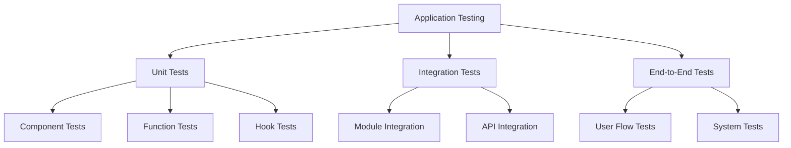
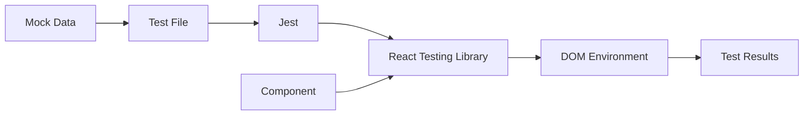

# Understanding React Testing

## What is Testing?

Think of testing like being a quality control inspector at a toy factory. Before sending toys to stores, you want to make sure:
1. Each part of the toy works correctly
2. The parts fit together properly
3. The toy is safe to use
4. The toy looks and behaves as designed

In software development, we do the same thing with our code. We write special programs (tests) that check if our application works correctly.

## Testing Hierarchy



### Types of Tests

1. **Unit Tests** (We're here!)
   - Test individual pieces in isolation
   - Like testing if a single Lego brick is the right shape
   - Quick to run, easy to write
   - Example: Testing if a button component changes color when clicked

2. **Integration Tests**
   - Test how pieces work together
   - Like testing if multiple Lego bricks fit together correctly
   - More complex, but catch interaction issues
   - Example: Testing if a form submission updates a list component

3. **End-to-End Tests**
   - Test the entire application flow
   - Like testing the completed toy from start to finish
   - Most comprehensive but slowest to run
   - Example: Testing if a user can log in and complete a purchase

## Our Testing Setup



### Key Components

1. **Jest**
   - The test runner (like the factory's testing machine)
   - Finds and runs test files
   - Reports results
   - Handles mocking (creating fake versions of things)

2. **React Testing Library**
   - Tools for testing React components
   - Simulates user interactions
   - Checks what users would see
   - Encourages good testing practices

3. **JSDOM**
   - Fake browser environment
   - Lets us test browser-like behavior
   - Runs in Node.js (no real browser needed)

4. **Test Files**
   - End in `.test.tsx` or `.test.ts`
   - Contain the actual test code
   - Live alongside the components they test

## Test Environment Setup

Our testing environment is configured to support React 18's concurrent features and proper hook initialization. The setup is defined in `tests/setupTests.ts` and includes:

### Core Configuration
- Jest as the primary test runner
- React Testing Library for component testing
- Support for React 18 concurrent features
- Proper initialization of React hooks and context
- Automated cleanup after each test
- Console logging for debugging test environment

### Key Features
```typescript
// tests/setupTests.ts
import '@testing-library/jest-dom';
import { configure } from '@testing-library/react';
import * as ReactDOM from 'react-dom/client';
import { createElement } from 'react';
import { act } from '@testing-library/react';

// Configure testing library
configure({ testIdAttribute: 'data-testid' });

// Initialize React root
const rootElement = document.createElement('div');
rootElement.id = 'root';
document.body.appendChild(rootElement);

// Setup React 18 concurrent features
beforeAll(async () => {
  const root = ReactDOM.createRoot(rootElement);
  await act(async () => {
    root.render(createElement('div'));
  });
});

// Cleanup after tests
afterEach(() => {
  jest.clearAllMocks();
});
```

## Test Types

### Unit Tests
- Component tests using React Testing Library
- Service and utility function tests
- Isolated tests with mocked dependencies

### Integration Tests
- API endpoint testing
- Component interaction testing
- Data flow validation

### End-to-End Tests
- Critical user journey testing
- Full application flow testing
- Cross-browser compatibility testing

## Coverage Requirements

### Critical Path (95%+)
- Authentication flows
- Data persistence operations
- API endpoints
- Core business logic
- Error handling paths

### Standard Coverage (80%+)
- UI components
- Utility functions
- Helper modules
- Non-critical paths

## Best Practices

### Component Testing
- Use React Testing Library queries
- Test behavior, not implementation
- Focus on user interactions
- Test accessibility
- Use proper test IDs

### Async Testing
- Use `act()` for state updates
- Handle promises properly
- Test loading states
- Verify error states

### Test Organization
- Group related tests
- Use descriptive names
- Follow AAA pattern
- Keep tests focused

## Debugging

### Available Tools
- Console logging in test environment
- React Testing Library debug output
- Jest watch mode
- Coverage reports

### Common Issues
- React hook initialization errors
- Async state updates
- Component rendering issues
- Test isolation problems

## Resources
- [Jest Documentation](https://jestjs.io/docs/getting-started)
- [React Testing Library](https://testing-library.com/docs/react-testing-library/intro/)
- [Testing React 18 Features](https://reactjs.org/docs/testing.html)
- [Question Components Test Documentation](components/question-components.test.md)
- Internal test documentation and examples

## Next Steps

- [Test File Structure](02-test-file-structure.md)
- [Writing Tests](03-writing-tests.md)
- [Running Tests](04-running-tests.md)
- [Common Issues](05-common-issues.md) 