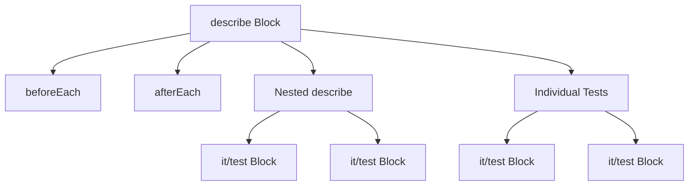

# Test File Structure

## Directory Organization

```
/tests
├── /unit
│   ├── /services
│   │   ├── AssessmentService.test.ts
│   │   ├── ModuleService.test.ts
│   │   └── ...
│   ├── /client
│   │   ├── /components
│   │   │   ├── Question.test.tsx
│   │   │   ├── QuestionModule.test.tsx
│   │   │   └── ...
│   │   └── /controllers
│   │       └── AssessmentFlowController.test.tsx
│   └── /utils
│       └── test-utils.tsx
├── /integration
│   ├── /api
│   └── /flows
└── /e2e
    └── /scenarios
```

## Test File Template

```typescript
import { describe, it, expect, jest, beforeEach, afterEach } from '@testing-library/jest-dom';
import { render, screen, fireEvent } from '@testing-library/react';
import { mockSupabase } from '../../../mocks/supabase';
import { localStorageMock } from '../../../mocks/localStorage';

describe('ComponentName or ServiceName', () => {
  // Mock setup
  const mockData = {
    // Test data
  };

  beforeEach(() => {
    // Reset mocks
    jest.clearAllMocks();
  });

  describe('Feature or Method Name', () => {
    it('should describe expected behavior', async () => {
      // Arrange
      const mockChain = {
        select: jest.fn().mockReturnValue({
          eq: jest.fn().mockReturnValue({
            is: jest.fn().mockReturnValue({
              single: jest.fn().mockResolvedValue({ data: mockData, error: null })
            })
          })
        })
      };
      (mockSupabase.from as jest.Mock).mockReturnValue(mockChain);

      // Act
      const result = await service.method();

      // Assert
      expect(result).toEqual(mockData);
    });

    it('should handle errors appropriately', async () => {
      // Arrange
      const mockError = { message: 'Error message', code: 'ERROR_CODE' };
      const mockChain = {
        select: jest.fn().mockReturnValue({
          eq: jest.fn().mockResolvedValue({ data: null, error: mockError })
        })
      };
      (mockSupabase.from as jest.Mock).mockReturnValue(mockChain);

      // Act & Assert
      await expect(service.method()).rejects.toThrow('Error message');
    });
  });
});
```

## Component Test Structure

```typescript
import { render, screen, fireEvent } from '@testing-library/react';
import { Question } from '../../../client/components/Question';

describe('Question Component', () => {
  const mockProps = {
    // Component props
  };

  it('should render correctly', () => {
    render(<Question {...mockProps} />);
    expect(screen.getByTestId('question')).toBeInTheDocument();
  });

  it('should handle user interaction', async () => {
    render(<Question {...mockProps} />);
    const button = screen.getByRole('button');
    await fireEvent.click(button);
    expect(mockProps.onAnswer).toHaveBeenCalled();
  });
});
```

## Service Test Structure

```typescript
import { AssessmentService } from '../../../client/services/AssessmentService';
import { mockSupabase } from '../../../mocks/supabase';

describe('AssessmentService', () => {
  let service: AssessmentService;

  beforeEach(() => {
    service = new AssessmentService(mockSupabase);
  });

  describe('createAssessment', () => {
    it('should create assessment when online', async () => {
      const mockChain = {
        insert: jest.fn().mockReturnValue({
          select: jest.fn().mockReturnValue({
            single: jest.fn().mockResolvedValue({ data: mockAssessment, error: null })
          })
        })
      };
      (mockSupabase.from as jest.Mock).mockReturnValue(mockChain);
      
      const result = await service.createAssessment(mockAssessment);
      expect(result).toEqual(mockAssessment);
    });
  });
});
```

## Controller Test Structure

```typescript
import { AssessmentFlowController } from '../../../client/controllers/AssessmentFlowController';

describe('AssessmentFlowController', () => {
  let controller: AssessmentFlowController;
  const mockAssessmentService = {
    // Mock service methods
  };

  beforeEach(() => {
    controller = new AssessmentFlowController(mockModules, mockAssessmentService, 'user1');
  });

  it('should handle navigation', async () => {
    await controller.nextQuestion();
    expect(controller.currentQuestionId).toBe('q2');
  });
});
```

## Mock Structure

```typescript
// mocks/supabase.ts
export const mockSupabase = {
  from: jest.fn(),
  auth: {
    signIn: jest.fn(),
    signOut: jest.fn()
  }
};

// mocks/localStorage.ts
export const localStorageMock = {
  getItem: jest.fn(),
  setItem: jest.fn(),
  removeItem: jest.fn(),
  clear: jest.fn()
};
```

## Test Utils

```typescript
// utils/test-utils.tsx
import { render } from '@testing-library/react';
import { TestProvider } from './TestProvider';

export const renderWithProviders = (ui: React.ReactElement) => {
  return render(ui, { wrapper: TestProvider });
};
```

## Best Practices

1. File Organization
   - Group related tests together
   - Use descriptive file names
   - Follow consistent directory structure

2. Test Structure
   - Use describe blocks for grouping
   - Write clear test descriptions
   - Follow AAA pattern (Arrange, Act, Assert)

3. Mocking
   - Keep mock implementations simple
   - Use consistent mock patterns
   - Reset mocks between tests

4. Error Handling
   - Test both success and error cases
   - Validate error messages and types
   - Test boundary conditions

5. Async Testing
   - Use async/await consistently
   - Handle promises properly
   - Test loading states

6. Component Testing
   - Test user interactions
   - Verify rendered content
   - Check accessibility

7. Service Testing
   - Mock external dependencies
   - Test offline functionality
   - Validate data transformations

8. Controller Testing
   - Test state management
   - Verify navigation logic
   - Test error handling

## Basic Structure

Every test file follows a similar pattern:

```typescript
// 1. Imports
import { render, screen } from '@testing-library/react';
import MyComponent from './MyComponent';

// 2. Mock Setup (if needed)
jest.mock('./someService', () => ({
  getData: jest.fn()
}));

// 3. Test Suite
describe('MyComponent', () => {
  // 4. Test Cases
  it('renders correctly', () => {
    render(<MyComponent />);
    expect(screen.getByText('Hello')).toBeInTheDocument();
  });
});
```

## Detailed Breakdown

### 1. Imports Section

```typescript
// Testing utilities
import { render, screen, fireEvent } from '@testing-library/react';
import '@testing-library/jest-dom';  // Adds custom matchers

// Component to test
import MyComponent from './MyComponent';

// Any other dependencies
import { someHelper } from './helpers';
```

- `render`: Creates a virtual DOM for testing
- `screen`: Helps find elements in the virtual DOM
- `fireEvent`: Simulates user interactions
- `@testing-library/jest-dom`: Adds special test checks for DOM elements

### 2. Mock Setup

```typescript
// Mock a service
jest.mock('./api', () => ({
  fetchData: jest.fn().mockResolvedValue({ data: 'test' })
}));

// Mock a hook
jest.mock('react', () => ({
  ...jest.requireActual('react'),
  useState: jest.fn()
}));

// Mock props
const mockProps = {
  title: 'Test Title',
  onClick: jest.fn()
};
```

Mocks are like stunt doubles in movies - they stand in for real things that might be:
- Too complex to test
- Dependent on external services
- Need to behave in specific ways for testing

### 3. Test Suite Structure

```typescript
describe('MyComponent', () => {
  // Runs before each test
  beforeEach(() => {
    jest.clearAllMocks();  // Reset all mocks
  });

  // Runs after each test
  afterEach(() => {
    cleanup();  // Clean up DOM
  });

  // Grouped tests
  describe('when loading', () => {
    it('shows loading spinner', () => {
      // Test code
    });
  });

  describe('when loaded', () => {
    it('shows content', () => {
      // Test code
    });
  });
});
```



### 4. Individual Test Structure

```typescript
it('updates count when clicked', () => {
  // 1. Arrange: Set up your test
  render(<Counter initial={0} />);
  
  // 2. Act: Perform the action
  const button = screen.getByRole('button');
  fireEvent.click(button);
  
  // 3. Assert: Check the results
  expect(screen.getByText('Count: 1')).toBeInTheDocument();
});
```

## Common Patterns

### Testing User Interactions

```typescript
it('responds to user input', () => {
  render(<TextInput />);
  
  // Find input element
  const input = screen.getByRole('textbox');
  
  // Simulate typing
  fireEvent.change(input, { target: { value: 'hello' } });
  
  // Check result
  expect(input.value).toBe('hello');
});
```

### Testing Async Operations

```typescript
it('loads data asynchronously', async () => {
  // Mock API response
  const mockData = { items: ['a', 'b', 'c'] };
  fetch.mockResponseOnce(JSON.stringify(mockData));
  
  render(<DataList />);
  
  // Check loading state
  expect(screen.getByText('Loading...')).toBeInTheDocument();
  
  // Wait for data
  await screen.findByText('a');
  
  // Check results
  expect(screen.getByText('b')).toBeInTheDocument();
  expect(screen.getByText('c')).toBeInTheDocument();
});
```

### Testing Error States

```typescript
it('handles errors gracefully', async () => {
  // Mock API error
  fetch.mockRejectOnce(new Error('API Error'));
  
  render(<DataList />);
  
  // Wait for error message
  const error = await screen.findByText('Something went wrong');
  expect(error).toBeInTheDocument();
});
```

## Best Practices

1. **Test Naming**
   ```typescript
   // Good
   it('shows error message when API fails')
   
   // Bad
   it('test API error')
   ```

2. **Arrange-Act-Assert Pattern**
   ```typescript
   it('example test', () => {
     // Arrange
     const props = { value: 5 };
     
     // Act
     render(<Component {...props} />);
     
     // Assert
     expect(screen.getByText('5')).toBeInTheDocument();
   });
   ```

3. **Use Data-testid Sparingly**
   ```typescript
   // Component
   <div data-testid="error-message">Error occurred</div>
   
   // Test
   expect(screen.getByTestId('error-message')).toBeInTheDocument();
   ```

4. **Test User Behavior, Not Implementation**
   ```typescript
   // Good
   it('allows user to submit form', () => {
     render(<Form />);
     fireEvent.change(screen.getByLabelText('Name'), {
       target: { value: 'John' }
     });
     fireEvent.click(screen.getByText('Submit'));
     expect(screen.getByText('Success!')).toBeInTheDocument();
   });
   
   // Bad (testing implementation details)
   it('sets state correctly', () => {
     const { result } = renderHook(() => useState(''));
     act(() => {
       result.current[1]('new value');
     });
     expect(result.current[0]).toBe('new value');
   });
   ``` 