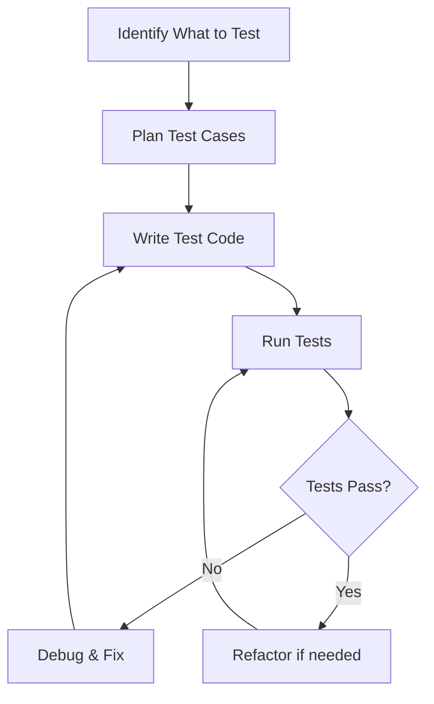

# Writing Tests: A Step-by-Step Guide

## The Testing Process



## Step 1: Identify What to Test

### Component Example: Button
```typescript
// Button.tsx
const Button = ({ label, onClick, disabled }) => (
  <button 
    onClick={onClick}
    disabled={disabled}
    className={disabled ? 'btn-disabled' : 'btn-active'}
  >
    {label}
  </button>
);
```

What should we test?
1. Does it render the label?
2. Does it call onClick when clicked?
3. Does it handle the disabled state?
4. Does it apply the correct classes?

## Step 2: Plan Test Cases

```typescript
// Button.test.tsx - Planning
describe('Button', () => {
  // Rendering tests
  it('renders with correct label');
  
  // Interaction tests
  it('calls onClick when clicked');
  it('does not call onClick when disabled');
  
  // State tests
  it('applies correct class when enabled');
  it('applies disabled class when disabled');
});
```

## Step 3: Write the Tests

### Basic Rendering Test

```typescript
import { render, screen } from '@testing-library/react';
import Button from './Button';

describe('Button', () => {
  it('renders with correct label', () => {
    // Arrange
    const label = 'Click Me';
    
    // Act
    render(<Button label={label} onClick={() => {}} />);
    
    // Assert
    expect(screen.getByText(label)).toBeInTheDocument();
  });
});
```

### Testing User Interactions

```typescript
it('calls onClick when clicked', () => {
  // Arrange
  const handleClick = jest.fn();  // Create a mock function
  render(<Button label="Click Me" onClick={handleClick} />);
  
  // Act
  screen.getByText('Click Me').click();
  
  // Assert
  expect(handleClick).toHaveBeenCalledTimes(1);
});
```

### Testing Different States

```typescript
it('applies correct classes based on disabled state', () => {
  // Test enabled state
  const { rerender } = render(
    <Button label="Click Me" onClick={() => {}} disabled={false} />
  );
  expect(screen.getByRole('button')).toHaveClass('btn-active');
  
  // Test disabled state
  rerender(
    <Button label="Click Me" onClick={() => {}} disabled={true} />
  );
  expect(screen.getByRole('button')).toHaveClass('btn-disabled');
});
```

## Common Testing Scenarios

### 1. Testing Forms

```typescript
describe('LoginForm', () => {
  it('submits form with user input', () => {
    const handleSubmit = jest.fn();
    render(<LoginForm onSubmit={handleSubmit} />);
    
    // Fill out form
    fireEvent.change(screen.getByLabelText('Username'), {
      target: { value: 'testuser' }
    });
    fireEvent.change(screen.getByLabelText('Password'), {
      target: { value: 'password123' }
    });
    
    // Submit form
    fireEvent.click(screen.getByText('Login'));
    
    // Check if form was submitted with correct data
    expect(handleSubmit).toHaveBeenCalledWith({
      username: 'testuser',
      password: 'password123'
    });
  });
});
```

### 2. Testing Async Operations

```typescript
describe('UserList', () => {
  it('loads and displays users', async () => {
    // Mock API response
    const mockUsers = [
      { id: 1, name: 'John' },
      { id: 2, name: 'Jane' }
    ];
    
    jest.spyOn(global, 'fetch').mockResolvedValue({
      json: async () => mockUsers
    });
    
    render(<UserList />);
    
    // Check loading state
    expect(screen.getByText('Loading...')).toBeInTheDocument();
    
    // Wait for users to load
    await screen.findByText('John');
    
    // Verify all users are displayed
    expect(screen.getByText('Jane')).toBeInTheDocument();
  });
});
```

### 3. Testing Error Handling

```typescript
describe('ErrorBoundary', () => {
  it('displays error message when child component crashes', () => {
    const BuggyComponent = () => {
      throw new Error('Test error');
    };
    
    render(
      <ErrorBoundary>
        <BuggyComponent />
      </ErrorBoundary>
    );
    
    expect(
      screen.getByText('Something went wrong')
    ).toBeInTheDocument();
  });
});
```

## Testing Hooks

```typescript
import { renderHook, act } from '@testing-library/react-hooks';

describe('useCounter', () => {
  it('increments counter', () => {
    const { result } = renderHook(() => useCounter());
    
    act(() => {
      result.current.increment();
    });
    
    expect(result.current.count).toBe(1);
  });
});
```

## Testing Context

```typescript
const wrapper = ({ children }) => (
  <ThemeContext.Provider value={{ theme: 'light' }}>
    {children}
  </ThemeContext.Provider>
);

describe('ThemedButton', () => {
  it('uses theme from context', () => {
    render(<ThemedButton />, { wrapper });
    expect(screen.getByRole('button')).toHaveClass('light-theme');
  });
});
```

## Common Mistakes to Avoid

1. **Testing Implementation Details**
```typescript
// Bad
expect(component.state.isLoading).toBe(false);

// Good
expect(screen.queryByText('Loading...')).not.toBeInTheDocument();
```

2. **Not Cleaning Up**
```typescript
describe('Component with timer', () => {
  afterEach(() => {
    jest.clearAllTimers();
  });
  
  it('updates after delay', () => {
    // test code
  });
});
```

3. **Hardcoding Test Values**
```typescript
// Bad
expect(screen.getByText('Total: $100')).toBeInTheDocument();

// Good
const price = 100;
render(<PriceDisplay amount={price} />);
expect(screen.getByText(`Total: $${price}`)).toBeInTheDocument();
```

## Debugging Tests

### 1. Using Debug Output
```typescript
it('helps with debugging', () => {
  const { debug } = render(<MyComponent />);
  debug(); // Prints DOM structure
  
  screen.getByText('something');
  debug(); // Check DOM after updates
});
```

### 2. Testing Playground
```typescript
it('can use testing playground', () => {
  render(<MyComponent />);
  screen.logTestingPlaygroundURL();
  // Opens URL with interactive selector tool
});
```

### 3. Console Logging
```typescript
it('shows intermediate values', () => {
  render(<MyComponent />);
  const element = screen.getByRole('button');
  console.log('Element classes:', element.className);
  expect(element).toHaveClass('active');
});
``` 