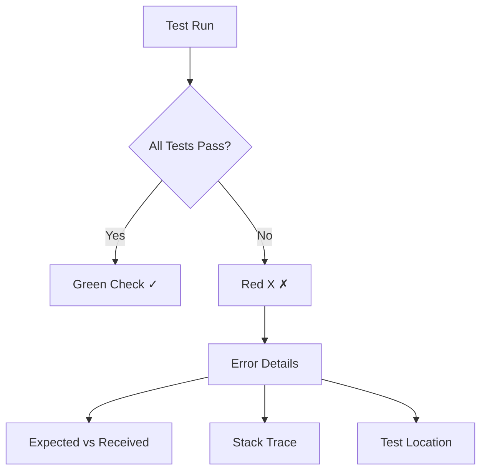

# Running Tests

## Test Commands

### Basic Commands

```bash
# Run all tests
npm test

# Run tests in watch mode (development)
npm test -- --watch

# Run tests once (CI/CD)
npm test -- --no-watch

# Run specific test file
npm test -- path/to/file.test.tsx

# Run tests matching a pattern
npm test -- -t "button"
```

## Understanding Test Output

```bash
 PASS  src/components/Button.test.tsx
 FAIL  src/components/Form.test.tsx
  ● Form › submits data correctly
    expect(received).toBe(expected)
    
    Expected: "success"
    Received: "error"
```



### Coverage Report

```bash
# Run tests with coverage
npm test -- --coverage

# Output:
----------------------|---------|----------|---------|---------|-------------------
File                  | % Stmts | % Branch | % Funcs | % Lines | Uncovered Line #s 
----------------------|---------|----------|---------|---------|-------------------
All files            |   85.71 |    83.33 |   88.89 |   85.71 |                   
 Button.tsx          |     100 |      100 |     100 |     100 |                   
 Form.tsx            |   71.43 |    66.67 |   77.78 |   71.43 | 24-35            
----------------------|---------|----------|---------|---------|-------------------
```

## Test Configuration

### Jest Configuration (jest.config.js)
```javascript
module.exports = {
  // Test environment
  testEnvironment: 'jsdom',
  
  // File patterns
  testMatch: [
    '**/__tests__/**/*.ts?(x)',
    '**/?(*.)+(spec|test).ts?(x)'
  ],
  
  // Coverage settings
  coverageThreshold: {
    global: {
      branches: 80,
      functions: 80,
      lines: 80,
      statements: 80
    }
  },
  
  // Setup files
  setupFilesAfterEnv: [
    '<rootDir>/src/setupTests.ts'
  ]
};
```

### Setup File (setupTests.ts)
```typescript
// Add custom matchers
import '@testing-library/jest-dom';

// Mock browser APIs
Object.defineProperty(window, 'matchMedia', {
  value: jest.fn().mockImplementation(query => ({
    matches: false,
    media: query,
    addEventListener: jest.fn(),
    removeEventListener: jest.fn()
  }))
});

// Clean up after each test
afterEach(() => {
  jest.clearAllMocks();
});
```

## Continuous Integration

### GitHub Actions Example
```yaml
name: Tests

on: [push, pull_request]

jobs:
  test:
    runs-on: ubuntu-latest
    
    steps:
    - uses: actions/checkout@v2
    
    - name: Setup Node.js
      uses: actions/setup-node@v2
      with:
        node-version: '16'
        
    - name: Install dependencies
      run: npm ci
      
    - name: Run tests
      run: npm test -- --no-watch
      
    - name: Upload coverage
      uses: codecov/codecov-action@v2
```

## Debugging Failed Tests

### 1. Interactive Mode
```bash
# Run tests in watch mode
npm test -- --watch

# Press keys to:
# a - run all tests
# f - run only failed tests
# p - filter by filename
# t - filter by test name
# q - quit watch mode
```

### 2. Verbose Output
```bash
npm test -- --verbose

# Shows detailed output:
# - Test suite hierarchy
# - Individual test results
# - Test execution time
```

### 3. Debug Mode
```bash
# Add debugger statement in your test
it('debug this test', () => {
  debugger;
  expect(true).toBe(true);
});

# Run with Node debugger
node --inspect-brk node_modules/.bin/jest --runInBand
```

## Test Performance

### 1. Running Tests in Parallel
```bash
# Run tests in parallel (default)
npm test

# Force sequential running
npm test -- --runInBand
```

### 2. Filtering Tests
```bash
# Run only changed files
npm test -- --onlyChanged

# Run specific test suite
npm test -- -t "Button component"

# Run tests matching file pattern
npm test -- Button
```

### 3. Timing Information
```bash
# Show slow tests
npm test -- --verbose --slowTestThreshold=5

# Output includes:
# - Test execution time
# - Slow test warnings
```

## Common Issues and Solutions

### 1. Test Environment Issues
```typescript
// Error: window is not defined
beforeAll(() => {
  Object.defineProperty(window, 'myAPI', {
    value: jest.fn()
  });
});
```

### 2. Async Test Failures
```typescript
// Error: Test completed while there were still pending operations
it('handles async operations', async () => {
  await act(async () => {
    render(<AsyncComponent />);
    await screen.findByText('Loaded');
  });
});
```

### 3. Memory Leaks
```typescript
// Warning: Memory leak detected
afterEach(() => {
  cleanup();  // Clean up rendered components
  jest.clearAllTimers();  // Clear any timers
});
```

## Best Practices for Test Runs

1. **Regular Test Runs**
```bash
# Add to package.json
{
  "scripts": {
    "test:watch": "jest --watch",
    "test:coverage": "jest --coverage",
    "test:ci": "jest --ci --coverage"
  }
}
```

2. **Pre-commit Hooks**
```json
// package.json
{
  "husky": {
    "hooks": {
      "pre-commit": "npm test -- --onlyChanged"
    }
  }
}
```

3. **Performance Monitoring**
```bash
# Track test execution time
npm test -- --verbose --detectOpenHandles
``` 