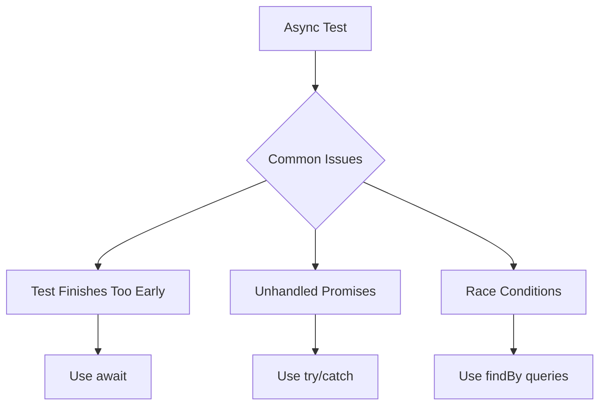

# Common Testing Issues and Solutions

## React Hook Errors

### The Problem
```typescript
TypeError: Cannot read properties of null (reading 'useState')
```

This error occurs when:
1. React hooks are called outside a React component
2. The test environment isn't properly set up
3. Component isn't wrapped in necessary providers

### The Solutions

1. **Proper Test Setup**
```typescript
// setupTests.ts
import '@testing-library/jest-dom';
const React = jest.requireActual('react');

// Don't mock React
jest.mock('react', () => ({
  ...React,
  // Only mock specific functions if needed
}));
```

2. **Correct Component Wrapping**
```typescript
// Wrong
render(<MyComponent />);

// Right
render(
  <React.StrictMode>
    <MyComponent />
  </React.StrictMode>
);
```

3. **Provider Wrapping**
```typescript
const wrapper = ({ children }) => (
  <Provider>
    {children}
  </Provider>
);

render(<MyComponent />, { wrapper });
```

## React 18 and Hooks Issues

### Invalid Hook Call Error
```
Error: Invalid hook call. Hooks can only be called inside of the body of a function component.
```

#### Common Causes
1. Multiple React versions in the project
2. Hooks called outside React components
3. Test environment not properly initialized

#### Solutions
1. Ensure proper React initialization in `setupTests.ts`:
```typescript
import * as ReactDOM from 'react-dom/client';
import { createElement } from 'react';
import { act } from '@testing-library/react';

const rootElement = document.createElement('div');
rootElement.id = 'root';
document.body.appendChild(rootElement);

beforeAll(async () => {
  const root = ReactDOM.createRoot(rootElement);
  await act(async () => {
    root.render(createElement('div'));
  });
});
```

2. Check for duplicate React installations:
```bash
npm ls react
npm ls react-dom
```

3. Ensure components are wrapped in proper test providers:
```typescript
import { render } from '@testing-library/react';

const AllTheProviders = ({ children }) => {
  return (
    <React.StrictMode>
      {/* Add other providers as needed */}
      {children}
    </React.StrictMode>
  );
};

const customRender = (ui, options) =>
  render(ui, { wrapper: AllTheProviders, ...options });
```

### Act Warning
```
Warning: An update to Component inside a test was not wrapped in act(...).
```

#### Solutions
1. Wrap state updates in `act()`:
```typescript
import { act } from '@testing-library/react';

test('component updates state', async () => {
  await act(async () => {
    // Perform state updates here
  });
});
```

2. Use `findBy` queries for async updates:
```typescript
const element = await screen.findByText('Updated Text');
```

## Async Testing Issues



### 1. Test Finishes Too Early

```typescript
// Wrong
it('loads data', () => {
  render(<DataComponent />);
  expect(screen.getByText('Loaded')).toBeInTheDocument();
});

// Right
it('loads data', async () => {
  render(<DataComponent />);
  await screen.findByText('Loaded');
});
```

### 2. Unhandled Promise Rejections

```typescript
// Wrong
it('handles errors', async () => {
  render(<DataComponent />);
  fireEvent.click(screen.getByText('Load'));
});

// Right
it('handles errors', async () => {
  render(<DataComponent />);
  await act(async () => {
    fireEvent.click(screen.getByText('Load'));
  });
});
```

### 3. Race Conditions

```typescript
// Wrong
it('updates list', async () => {
  render(<List />);
  fireEvent.click(screen.getByText('Add'));
  expect(screen.getByText('New Item')).toBeInTheDocument();
});

// Right
it('updates list', async () => {
  render(<List />);
  fireEvent.click(screen.getByText('Add'));
  await screen.findByText('New Item');
});
```

## Mock Issues

### 1. Mock Not Working

```typescript
// Wrong
jest.mock('./api');
import { api } from './api';

// Right
jest.mock('./api', () => ({
  api: {
    getData: jest.fn().mockResolvedValue({ data: 'test' })
  }
}));
```

### 2. Mock Not Resetting

```typescript
// Wrong
const mockFn = jest.fn();

// Right
beforeEach(() => {
  jest.clearAllMocks();
});
const mockFn = jest.fn();
```

### 3. Complex Mock Implementation

```typescript
// Wrong
jest.mock('./complex-module');

// Right
jest.mock('./complex-module', () => {
  const originalModule = jest.requireActual('./complex-module');
  return {
    ...originalModule,
    complexFunction: jest.fn().mockImplementation((arg) => {
      if (arg === 'test') return 'mocked';
      return originalModule.complexFunction(arg);
    })
  };
});
```

## DOM Issues

### 1. Element Not Found

```typescript
// Wrong
expect(screen.getByText('Loading...')).toBeInTheDocument();

// Right
// For elements that might not exist yet
await screen.findByText('Loading...');

// For elements that might not exist at all
expect(screen.queryByText('Loading...')).not.toBeInTheDocument();
```

### 2. Event Handling

```typescript
// Wrong
fireEvent.click(button);
expect(result).toBe('clicked');

// Right
await act(async () => {
  fireEvent.click(button);
});
expect(result).toBe('clicked');
```

### 3. Form Interactions

```typescript
// Wrong
fireEvent.change(input, 'new value');

// Right
fireEvent.change(input, { target: { value: 'new value' } });
```

## Context and Provider Issues

### 1. Missing Provider

```typescript
// Wrong
render(<ComponentThatUsesContext />);

// Right
const wrapper = ({ children }) => (
  <ContextProvider value={mockValue}>
    {children}
  </ContextProvider>
);
render(<ComponentThatUsesContext />, { wrapper });
```

### 2. Multiple Providers

```typescript
// Wrong
render(
  <Provider1>
    <Provider2>
      <Component />
    </Provider2>
  </Provider1>
);

// Right
const AllTheProviders = ({ children }) => {
  return (
    <Provider1>
      <Provider2>
        {children}
      </Provider2>
    </Provider1>
  );
};

const customRender = (ui, options) =>
  render(ui, { wrapper: AllTheProviders, ...options });
```

## Performance Issues

### 1. Slow Tests

```typescript
// Wrong
describe('slow tests', () => {
  beforeEach(() => {
    // Heavy setup
  });
  
  it('test 1', () => {/* ... */});
  it('test 2', () => {/* ... */});
});

// Right
describe('optimized tests', () => {
  let heavySetup;
  
  beforeAll(() => {
    heavySetup = // Do once for all tests
  });
  
  it('test 1', () => {
    const instance = heavySetup.clone();
    // Use instance
  });
});
```

### 2. Memory Leaks

```typescript
// Wrong
const component = render(<Component />);
// Test ends without cleanup

// Right
afterEach(() => {
  cleanup();
});
```

## Coverage Issues

### 1. Missing Coverage

```typescript
// Wrong
if (condition) {
  doSomething();
}

// Right
it('handles condition true', () => {
  condition = true;
  expect(doSomething).toBeCalled();
});

it('handles condition false', () => {
  condition = false;
  expect(doSomething).not.toBeCalled();
});
```

### 2. Branch Coverage

```typescript
// Function with multiple branches
function processValue(value) {
  if (value < 0) return 'negative';
  if (value > 0) return 'positive';
  return 'zero';
}

// Tests
describe('processValue', () => {
  it.each([
    [-1, 'negative'],
    [1, 'positive'],
    [0, 'zero']
  ])('processes %i to %s', (input, expected) => {
    expect(processValue(input)).toBe(expected);
  });
});
```

## Environment Issues

### 1. Browser APIs

```typescript
// Wrong
// Test fails because window.localStorage is not available

// Right
const localStorageMock = {
  getItem: jest.fn(),
  setItem: jest.fn(),
  clear: jest.fn()
};
global.localStorage = localStorageMock;
```

### 2. Timers

```typescript
// Wrong
it('handles timeout', () => {
  setTimeout(() => {
    expect(something).toBe(true);
  }, 1000);
});

// Right
it('handles timeout', () => {
  jest.useFakeTimers();
  setTimeout(() => {
    expect(something).toBe(true);
  }, 1000);
  jest.runAllTimers();
});
```

### 3. Random Values

```typescript
// Wrong
it('generates random ID', () => {
  expect(generateId()).toMatch(/[0-9a-f]{8}/);
});

// Right
it('generates random ID', () => {
  const mockMath = Object.create(global.Math);
  mockMath.random = () => 0.5;
  global.Math = mockMath;
  expect(generateId()).toBe('7b8d9f2e');
});
``` 