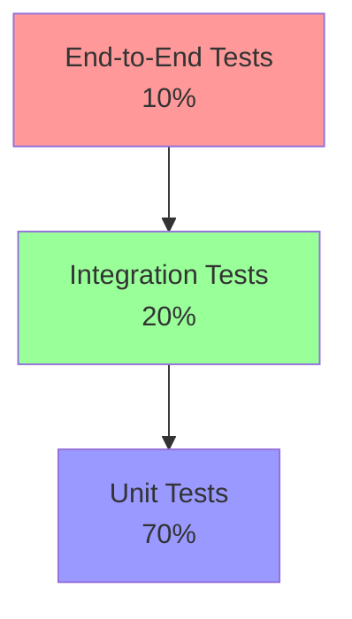

# Comprehensive Test Strategy

## Table of Contents
1. [Overview](#overview)
2. [Testing Pyramid](#testing-pyramid)
3. [Test Categories](#test-categories)
4. [Coverage Requirements](#coverage-requirements)
5. [Testing Tools and Framework](#testing-tools-and-framework)
6. [Test Organization](#test-organization)
7. [Best Practices](#best-practices)
8. [Continuous Integration](#continuous-integration)
9. [Test Data Management](#test-data-management)
10. [Reporting and Metrics](#reporting-and-metrics)

## Overview

This document outlines our comprehensive testing strategy, designed to ensure high-quality, maintainable, and reliable code. Our testing approach is built on the following principles:

- Test-Driven Development (TDD) as the primary development methodology
- Clear separation of test types and responsibilities
- Comprehensive coverage across all application layers
- Automated testing integrated into the CI/CD pipeline
- Regular test maintenance and review

## Testing Pyramid

Our testing strategy follows the standard testing pyramid structure:



### Test Distribution
- **Unit Tests**: 70% of total test count
  - Focus on individual components and functions
  - Fast execution and high isolation
  - Coverage of edge cases and error conditions

- **Integration Tests**: 20% of total test count
  - Test component interactions
  - API contract validation
  - Service integration verification

- **End-to-End Tests**: 10% of total test count
  - Critical user journeys
  - Full system integration
  - Real-world scenarios

## Test Categories

### 1. Unit Tests
Located in `tests/unit/`:
- Component tests (`client/`)
- Service tests (`services/`)
- Utility function tests
- Isolated module tests

### 2. Integration Tests
Located in `tests/integration/`:
- API integration tests
- Component interaction tests
- Database integration tests
- Service interaction tests

### 3. End-to-End Tests
Located in `tests/e2e/`:
- User journey tests
- Critical path testing
- Cross-browser compatibility
- Performance testing scenarios

### 4. Contract Tests
Located in `tests/__contracts__/`:
- API contract validation
- Interface compliance tests
- External service integration tests

## Coverage Requirements

| Component Type | Line Coverage | Branch Coverage | Function Coverage |
|---------------|---------------|-----------------|-------------------|
| Core Services | 90% | 85% | 90% |
| UI Components | 80% | 75% | 80% |
| API Endpoints | 100% | 95% | 100% |
| Utilities | 85% | 80% | 85% |

### Critical Areas Requiring 100% Coverage
- Authentication flows
- Data validation logic
- Financial calculations
- Security-critical functions
- Error handling paths

## Testing Tools and Framework

### Primary Tools
- **Jest**: Main testing framework
- **React Testing Library**: Component testing
- **Playwright**: E2E testing
- **Istanbul**: Code coverage reporting
- **TypeScript**: Type checking and compilation

### Configuration Files
```typescript
// jest.config.js
module.exports = {
  preset: 'ts-jest',
  testEnvironment: 'jsdom',
  setupFilesAfterEnv: [
    '<rootDir>/tests/setup.ts',
    '<rootDir>/tests/setupTests.ts'
  ],
  collectCoverage: true,
  coverageThreshold: {
    global: {
      branches: 80,
      functions: 80,
      lines: 80,
      statements: 80
    }
  }
}
```

## Test Organization

### Directory Structure
```
tests/
├── e2e/                    # End-to-end tests
├── integration/            # Integration tests
├── unit/                   # Unit tests
│   ├── client/            # Frontend component tests
│   └── services/          # Service layer tests
├── __contracts__/         # Contract tests
├── __fixtures__/          # Test fixtures
├── __mocks__/            # Mock implementations
├── templates/            # Test templates
├── utils/               # Testing utilities
└── test-results/        # Test reports
```

### Naming Conventions
- Unit tests: `*.test.ts` or `*.test.tsx`
- Integration tests: `*.integration.test.ts`
- E2E tests: `*.e2e.test.ts`
- Contract tests: `*.contract.test.ts`

## Best Practices

### 1. Test Structure
```typescript
describe('ComponentName', () => {
  // Setup and teardown
  beforeEach(() => {
    // Common setup
  });

  afterEach(() => {
    // Cleanup
  });

  describe('specific functionality', () => {
    it('should behave in a specific way', () => {
      // Arrange
      // Act
      // Assert
    });
  });
});
```

### 2. Component Testing
- Use React Testing Library queries
- Test from user perspective
- Avoid implementation details
- Focus on accessibility

### 3. Mocking
- Use `__mocks__` directory for module mocks
- Mock external dependencies
- Keep mocks simple and maintainable
- Document mock behavior

### 4. Test Data
- Use `__fixtures__` for test data
- Maintain data isolation
- Use factories for complex objects
- Version control test data

## Continuous Integration

### CI Pipeline Integration
```yaml
test:
  stage: test
  script:
    - npm run test:unit
    - npm run test:integration
    - npm run test:e2e
  coverage: '/All files[^|]*\|[^|]*\s+([\d\.]+)/'
  artifacts:
    reports:
      coverage: coverage/lcov-report/
      junit: tests/test-results/junit.xml
```

### Test Execution Order
1. Linting and type checking
2. Unit tests
3. Integration tests
4. Contract tests
5. E2E tests
6. Coverage reporting

## Test Data Management

### Test Data Sources
1. Static fixtures
2. Factory functions
3. Test databases
4. Mock APIs

### Data Isolation
- Use unique identifiers per test
- Clean up test data after execution
- Avoid test interdependencies
- Maintain data versioning

## Reporting and Metrics

### Coverage Reports
- HTML coverage reports
- JUnit XML reports
- Trend analysis
- Coverage badges

### Test Results Store
```typescript
interface TestResultMetadata {
  testId: string;
  status: 'passed' | 'failed' | 'skipped';
  duration: number;
  timestamp: string;
}
```

### Metrics Tracking
- Test execution time
- Coverage trends
- Failure rates
- Flaky test identification

### Performance Monitoring
- Response time tracking
- Resource utilization
- Memory leaks detection
- Load test results 